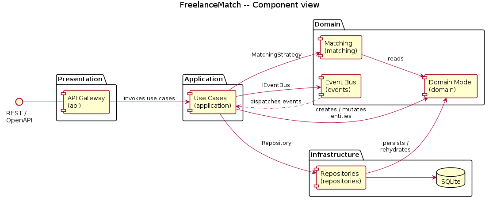
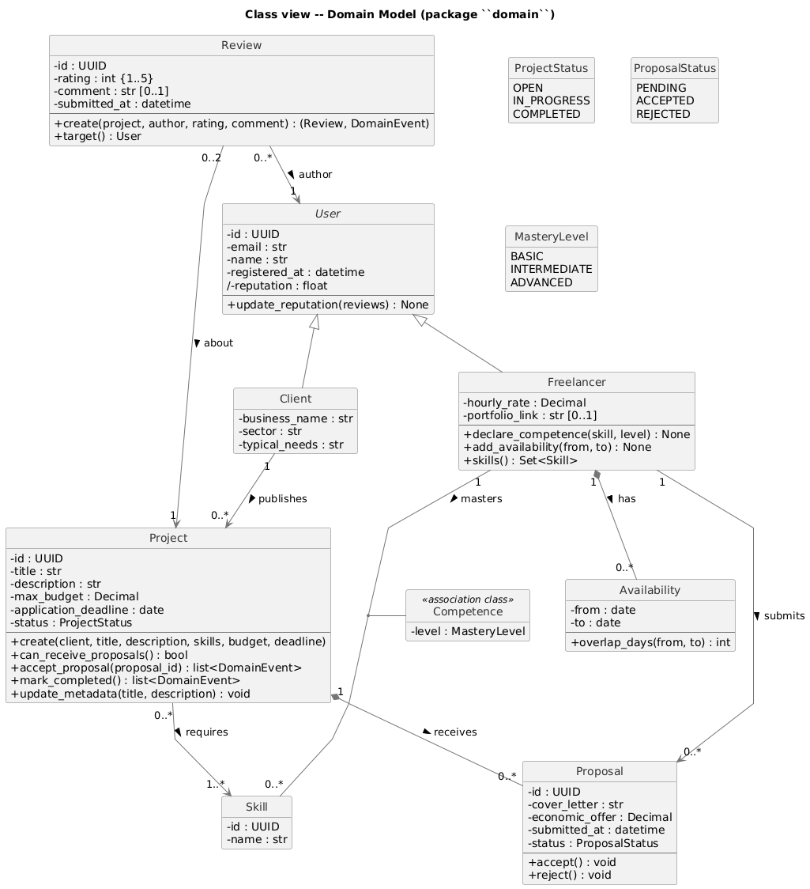
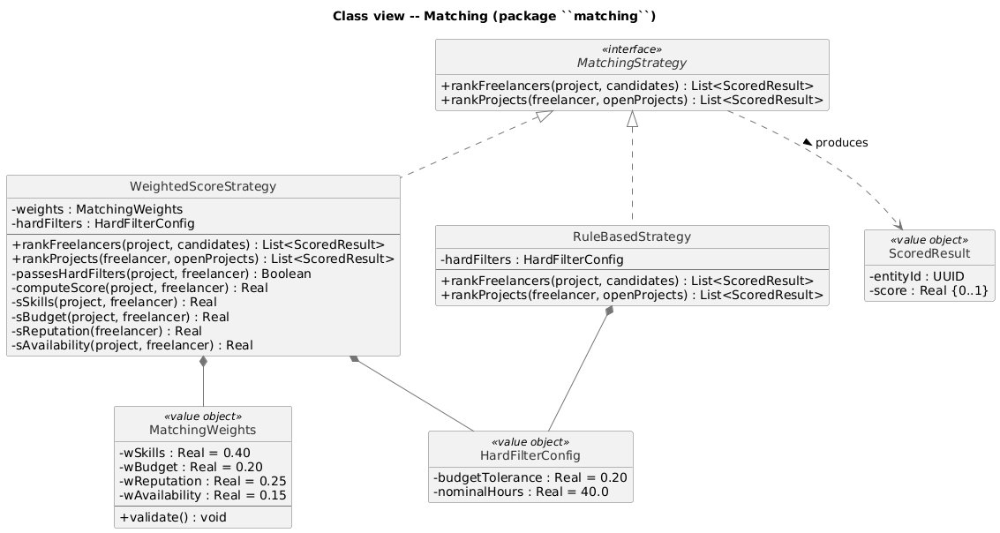
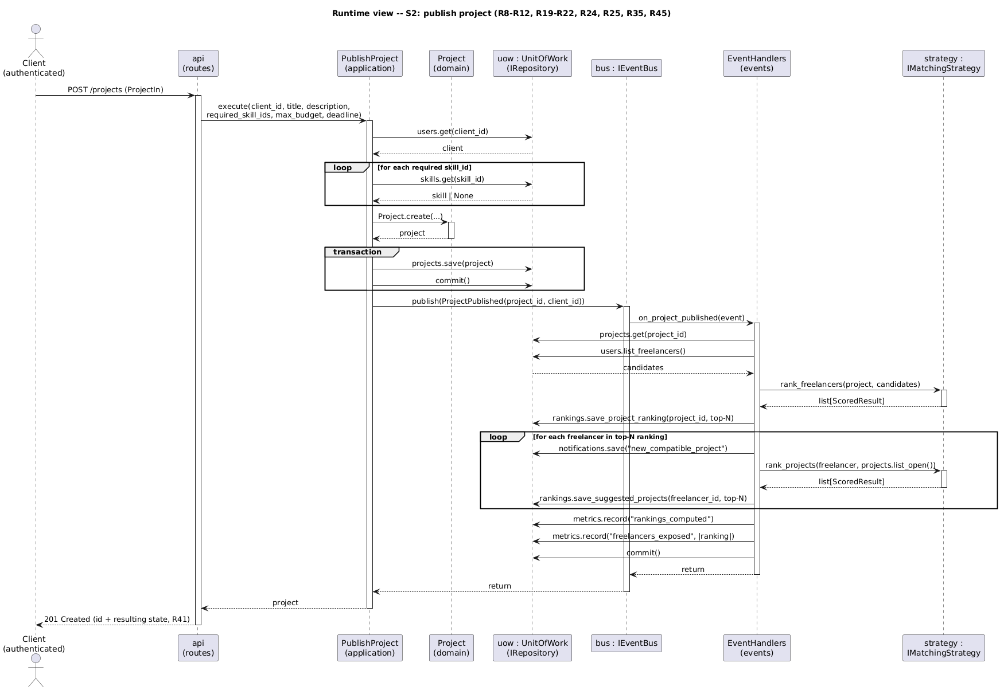
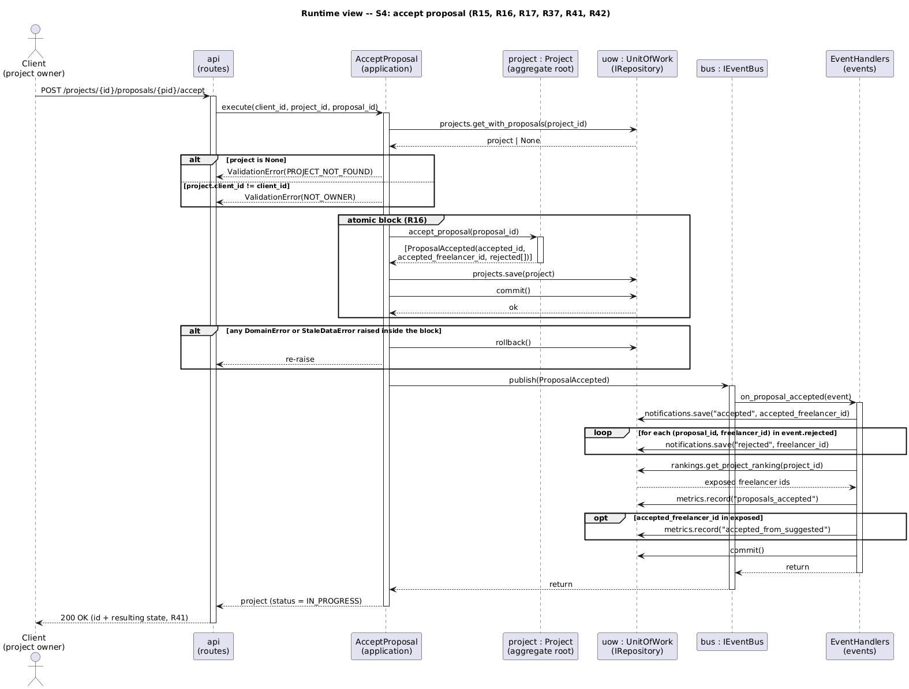
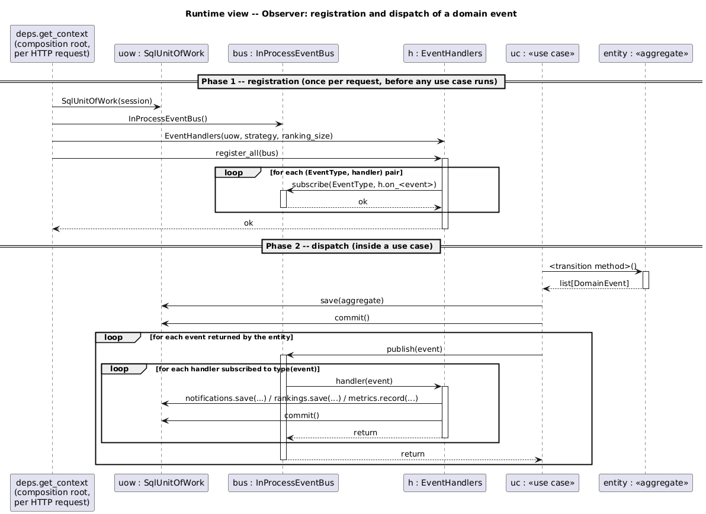

# Design Document

### FreelanceMatch
*A web platform for automatic freelancer–client matching*

**Politecnico di Milano**
Software Engineering for Automation — A.Y. 2025-2026

| | |
|---|---|
| **Authors** | Olmo Luca (10838404), Palladino Antonio (10778757), Pensotti Francesca (10777621) |
| **Repository** | `https://github.com/antopalla02/SE4A_LucaOlmo_AntonioPalladino_FrancescaPensotti.git` |

---

## Table of contents

- [1. Introduction](#1-introduction)
  - [1.1 Purpose](#11-purpose)
  - [1.2 Definitions, Acronyms, Abbreviations](#12-definitions-acronyms-abbreviations)
  - [1.3 Revision history](#13-revision-history)
  - [1.4 Document structure](#14-document-structure)
- [2. Architectural Design](#2-architectural-design)
  - [2.1 Component view](#21-component-view)
  - [2.2 Class view](#22-class-view)
  - [2.3 Runtime view](#23-runtime-view)
  - [2.4 Selected architectural styles and patterns](#24-selected-architectural-styles-and-patterns)
- [3. User Interface Design](#3-user-interface-design)
- [4. Requirements Traceability](#4-requirements-traceability)
- [5. Implementation, Integration and Test Plan](#5-implementation-integration-and-test-plan)
- [6. References](#6-references)

## 1. Introduction

### 1.1 Purpose

This document describes the design of FreelanceMatch, the web platform for automatic freelancer–client matching whose requirements are specified in the Requirements Analysis and Specification Document (RASD) of Deliverable 1. While the RASD answers the question of *what* the system must do — its goals (G1–G5), its functional requirements (R1–R45) and the qualities it must exhibit (NFR1–NFR6) — this document answers the question of *how* the system is organised to do it.

The main goals of the project, stated in full in RASD Sec. 1.1, are recalled here in compact form to keep this document self-contained:

- **G1/G2** — bidirectional automatic matching: ranked freelancers for every published project, ranked projects for every registered freelancer;
- **G3** — management of the full project lifecycle with the constraints of each phase;
- **G4** — reputation derived from mutual reviews, fed back into the matching;
- **G5** — manual search, so that both parties can look for a counterpart and decide independently of the suggested ranking.

The design presented here is organised around four decisions, each anticipated in the RASD and motivated in Sec. 2.4 of this document:

- a *Strategy* interface that isolates the matching algorithm, so that the active strategy is substitutable by configuration (R26) and two strategies can be compared through the metrics of R44;
- an *Observer*-based event mechanism that decouples lifecycle transitions from their side effects — notifications (R35–R38) and ranking recomputation (R19, R21, R23);
- a *Repository* layer that abstracts data access, so that the domain logic can be tested against in-memory implementations and the choice of store stays open, as DEP1 assumes;

The target implementation, described in Sec. 5, is a Python web service exposing a REST API (FastAPI) backed by a relational store (SQLite via SQLAlchemy); the system is delivered API-first, with the auto-generated OpenAPI interface serving as the demonstration UI (see Sec. 3).

### 1.2 Definitions, Acronyms, Abbreviations

The definitions of the domain terms (Client, Freelancer, Project, Proposal, Review, Reputation, Matching, Compatibility score *S(P,F)*, etc.) are given in RASD Sec. 1.3.1 and are not repeated here. The following additional terms are specific to this document.

| Term | Definition |
|---|---|
| **Component** | A unit of the system with a well-defined responsibility and an explicit interface towards the other components. In this design, components correspond to Python packages. |
| **Use case (application service)** | The orchestration of a single user-triggered flow (one of the scenarios S1–S6 of RASD Sec. 2.1), implemented as one application-layer module that coordinates domain entities, repositories and events. |
| **Aggregate / aggregate root** | A cluster of entities loaded, mutated and saved as a unit, addressed through a single root entity. `Project` is the only aggregate root of this design (Sec. 2.2.1). |
| **Event bus** | The in-process publish/subscribe mechanism through which lifecycle events are propagated to their observers. |
| **Domain layer** | The set of entities and value objects of RASD Sec. 2.2, implemented without dependencies on frameworks, persistence or transport. |
| **Lifecycle rule** | A constraint on the admissible states or transitions of an entity, stated as a requirement in RASD Sec. 2.4 (e.g. R14, R15, R31) and enforced inside the entity that owns it. |
| **DTO** | Data Transfer Object: the request/response schema exposed by the REST API, distinct from the domain entities. |

| Acronym | Meaning |
|---|---|
| DD | Design Document |
| RASD | Requirements Analysis and Specification Document |
| API | Application Programming Interface |
| REST | Representational State Transfer |
| ORM | Object-Relational Mapping |
| FSM | Finite State Machine |

### 1.3 Revision history

| Version | Date | Notes |
|---------|------|-------|
| 0.1 | 2026-06-10 | Initial draft. Section 1 (Introduction). |
| 0.2 | 2026-06-20 | Added 2.1 2.2 2.3 2.4 |
| 0.3 | 2026-07-01 | Added section 3 4 5. |
| 1.0 | 2026-07-12 | Added section 6 + revision and fixes. |

### 1.4 Document structure

**Section 2 (Architectural Design)** presents the architecture from four complementary points of view: the component view (Sec. 2.1) identifies the components, their responsibilities and the interfaces they export; the class view (Sec. 2.2) refines the most relevant components into class diagrams; the runtime view (Sec. 2.3) shows how the components interact to accomplish the main scenarios of the RASD; Sec. 2.4 names and motivates the architectural styles and design patterns adopted.

**Section 3 (User Interface Design)** describes the interface through which the system is operated, which in this API-first delivery is the auto-generated OpenAPI (Swagger) console.

**Section 4 (Requirements Traceability)** maps the requirements R1–R45 of the RASD onto the design elements introduced in Section 2.

**Section 5 (Implementation, Integration and Test Plan)** defines the order in which the components will be implemented, the order in which they will be integrated, and the strategy for testing the integration.

**Section 6 (References)** lists the sources cited in this document.
## 2. Architectural Design

### 2.1 Component view

Figure 1 shows the six components of the system, one per Python package:
`api`, `application`, `matching`, `events`, `repositories`, `domain`. Every
dependency points inward, towards the domain, which has no outgoing
dependency: it does not know how it is stored, how it is exposed over the
network, or which matching algorithm is active. This is what makes the
two replaceability requirements of the RASD achievable without touching
the business logic — R26 for the matching strategy, DEP1 for the data
store.

The arrows labelled `via IMatchingStrategy` / `via IEventBus` /
`via IRepository` cross a replaceability boundary: `application` and
`events` depend on an interface, not on a concrete implementation, so
`matching` and `repositories` can each be swapped without any caller
changing. 

#### 2.1.1 API Gateway (`api`)

The single entry point of the system. It exposes the REST interface described by the auto-generated OpenAPI specification (Sec. 3), translates HTTP requests into invocations of the application-layer use cases, and translates results and errors back into HTTP responses. The component contains no business logic.

Exported interface: the **REST/OpenAPI** surface, one router per requirement cluster of RASD Sec. 2.4 (accounts R1–R10, project lifecycle R11–R18, matching R19–R26, search R27–R29, reviews R30–R34, notifications and dashboard R35–R40, cross-cutting R41–R45).

#### 2.1.2 Use Cases (`application`)

One module per scenario of RASD Sec. 2.1: `register_user` (S1, with profile update and skill request), `publish_project` (S2), `submit_proposal` (S3), `accept_proposal` (S4), `complete_and_review` (S5), `manual_search` (S6), `update_project` (S7 — the `Client` owner edits a project's title/description while it is still `open`).

Every use case is a class whose collaborators are injected through the constructor — a `UnitOfWork` and an `IEventBus`, or a `MatchingStrategy` in place of the bus for the read-only `manual_search` — and whose `execute` method has the same four-step shape:

1. **load** the entities involved, through the repository interfaces;
2. **delegate the decision** to a domain entity method, which validates, mutates, and returns the events its transition implies;
3. **persist and commit** — this is where the transactional boundary is drawn, and where the atomicity of R16 is realised;
4. **publish** the returned events, strictly after the commit.

`manual_search` and `update_project` are both exceptions to this shape. `manual_search` is read-only: there is nothing to persist or commit, and no event to publish (it stops after step 1); `update_project` is a self-transition with no side effect on any other aggregate, so it returns no event and (steps 1–3 apply).

What a use case must *not* contain is a business rule: any condition that decides whether a transition is legal belongs to the entity. What legitimately remains is authorisation (is the actor the project owner? R15, R42), the cross-aggregate lookups an entity cannot perform (is this skill in the controlled vocabulary? R9), and the ordering of persistence and publication.

Exported interface: the `execute` operations, one per scenario, consumed only by `api`.

#### 2.1.3 Domain Model (`domain`)

The implementation of the entities and relationships of RASD Sec. 2.2: `User` (with `Client` and `Freelancer`), `Skill`, `Competence`, `Availability`, `Project`, `Proposal`, `Review`. 
The `domain` package also declares `domain events` and `domain errors`.

- `domain events` : `ProjectPublished`, `ProposalReceived`,
  `ProposalAccepted`, `CollaborationCompleted`, `ReviewSubmitted`,
  `ProfileUpdated`.
- `domain errors` : split into three categories: malformed input
  (`ValidationError`), violated business rule (`InvariantViolation`),
  illegal state transition (`IllegalTransition`).

The component depends on nothing: no framework, no ORM, no transport. It is importable and testable in isolation, which is the precondition for the domain tests to run without a database or a web server.

#### 2.1.4 Matching (`matching`)

The matching procedure behind the **IMatchingStrategy** interface (R26). The interface exposes the two ranking directions of G1 and G2 as two operations — `rankFreelancers(project, candidates)` and `rankProjects(freelancer, openProjects)` — both returning results ordered by decreasing score; truncation to the configurable length *N* of R19/C5 is left to the caller, so the strategy carries no presentation concern.

Two implementations are provided: `WeightedScoreStrategy`, realising the score *S(P,F)* of R24 with the hard filters of R25, and `RuleBasedStrategy`, the sequential-criteria baseline against which the active strategy is compared through the metrics of R44. The active one is selected by configuration at startup; adding a third requires implementing the interface and adding one configuration value, with no change to any other component.

Exported interface: **IMatchingStrategy**, plus the two configuration value objects `MatchingWeights` and `HardFilterConfig`.

#### 2.1.5 Event Bus (`events`)

The in-process publish/subscribe mechanism behind the **IEventBus** interface, together with the handlers that subscribe to it. Use cases publish typed lifecycle events; handlers registered at startup react to them, creating notifications (R35–R38), computing and refreshing rankings (R19, R21, R23) and recording the matching-quality metrics that R44 exposes.

The bus maps event types to handler callables and invokes them synchronously on publication. It never imports `application`: the callables reach it through `subscribe`, so the publisher does not know its subscribers, and adding a side effect to an existing event means registering one more handler rather than editing the use case that publishes it.

Exported interface: **IEventBus** — `subscribe(eventType, handler)` and `publish(event)`.

#### 2.1.6 Repositories (`repositories`)

The data-access layer behind the **IRepository** family — one interface
per independent entity (users, projects, reviews, notifications, skills)
plus two supporting ones for the persisted ranking projection and the R44
counters — and the **UnitOfWork** that bundles them into one
transactional context.

Two implementations are provided, serving different purposes:

- **SQLite implementation** — used at runtime. It realises the
  `IRepository` interfaces, handling all database access and converting
  between ORM rows and domain entities in both directions (`save()` maps
  entities to rows, `get()`/`get_with_proposals()` reconstructs entities
  from rows). Choosing SQLite as the data store is what satisfies DEP1,
  since it provides the transactional guarantees that dependency
  requires; its commit strategy is what then realises R16.

- **In-memory implementation** — used by the test suite. It stores
  entities in plain Python dictionaries instead of a database, so domain
  and application-layer tests run in milliseconds with no setup and no
  external dependency. It satisfies the same `IRepository` interfaces as
  the SQLite implementation, so the use cases run unmodified against
  either one — only the wiring in the composition root changes.

Exported interface: the **IRepository** family and **UnitOfWork** (`commit`, `rollback`).

#### 2.1.7 Dependency rules

The dependency rules, visible as arrow directions in Figure 1, are enforced by the import structure: a violation is either an import cycle or an import of a concrete class where an interface is expected.

| Component | May depend on | Must not depend on |
|---|---|---|
| `api` | `application`, and the interfaces it must name to wire them | business rules of any kind |
| `application` | `domain`, and the three interfaces (`MatchingStrategy`, `IEventBus`, `UnitOfWork`) | concrete implementations in `matching`, `events`, `repositories` |
| `domain` | nothing | everything else |
| `matching` | `domain` | `application`, `api`, `repositories`, `events` |
| `events` | `domain`, and the interfaces `UnitOfWork` and `MatchingStrategy` used by the handlers | `application`, `api` |
| `repositories` | `domain` | `application`, `api`, `matching`, `events` |

### 2.2 Class view

This section refines some the components of Sec. 2.1  providing their class views; first the domain, then matching.

The other components have no class diagram here — their structure is
already covered elsewhere. The API Gateway is entirely determined by
the OpenAPI surface of Sec. 3. `events` is described in Sec. 2.3.3 /
2.4.3. `repositories` is described in Sec. 2.4.4.

#### 2.2.1 Domain Model

Figure 2 is the implementation-level refinement of the conceptual domain model of RASD Sec. 2.2.  The refinement consists of the operations each entity exposes and the enumerations backing the `status` and `level` attributes, whose values are exactly the state names of RASD Sec. 3.2.

**State transitions are operations of the entities themselves**, not procedures of the application layer. `Project.acceptProposal()` and `Project.markCompleted()` implement the FSM of RASD Sec. 3.2.1; `Proposal.accept()` and `Proposal.reject()` implement the FSM of RASD Sec. 3.2.2. Each checks the current state and raises a domain error when the transition is not legal, before any side effect occurs. This placement is what guarantees that the lifecycle rules cannot be bypassed: no code path mutates a `status` attribute directly, so every caller goes through the validating operations. The same holds for construction: `Project.create()` is a factory enforcing R11 and setting `status = open` per R12, so an invalid project is not representable. `updateMetadata()` is the self-transition of R45, and it refuses to run once the project has left `open`.

Transition operations **return the events they imply** rather than dispatching them. `acceptProposal()` returns a `ProposalAccepted` naming the accepted proposal and the rejected freelancers — the entity is the only object that knows which proposals it rejected, so making it the source of that payload avoids a second traversal in the caller. The entity *decides* what happened; the application layer *publishes* it after the commit (Sec. 2.3). The split keeps the domain free of any dependency on the event infrastructure while leaving the entity the single source of truth.

`Project` and `Proposal` are related by **composition** in the RASD
model — a `Proposal` has no existence independent of the `Project` it
was submitted to. In the design, this composition is realised as an
**aggregate**: `Project` is the aggregate root, `Proposal` lives inside
its consistency boundary, and the two are always loaded, mutated and
saved together, never separately.

The reason this boundary exists is R16: accepting a proposal changes
three things at once — the chosen proposal becomes accepted, every other
pending proposal becomes rejected, the project becomes `in_progress` —
and R16 requires these three changes to happen atomically. Treating
`Project` and its `Proposal`s as a single unit is what makes that
possible, and it is also what lets the constraint of R15 (at most one
accepted proposal per project) be checked directly in memory, without an
extra query.

**`Review` has no update operation.**, the class simply exposes no method to modify a review once created. This is how R32 (reviews are immutable) is realised.

#### 2.2.2 Matching

Figure 3 shows the `matching` package, the realisation of the *Strategy* pattern required by R26.

`MatchingStrategy` is the interface the application layer depends on. It
exposes the two ranking directions required by G1 and G2 — client-side
("rank freelancers for this project") and freelancer-side ("rank
projects for this freelancer") — as two separate operations, both
returning a list of `ScoredResult`: a pair of entity id and score,
rather than the full entity. The ranking is only ever persisted as a
projection and serialised to the client, and neither use needs more
than the id — carrying the full entity would duplicate data without any need.

Both operations are pure functions of their arguments — the score
depends only on the `project`/`freelancer` and candidates passed in,
never on anything from a previous call. A strategy carries no mutable
state beyond its fixed configuration (weights, filters), so one instance
can be created once at startup and safely reused across every concurrent
request, with no risk of one computation interfering with another.

`WeightedScoreStrategy` realises the score of R24 as a weighted sum of four sub-scores, each normalised in [0,1]: skills coverage weighted by mastery level, budget compatibility (the estimated cost against the maximum budget), reputation, and the fraction of the project window covered by the freelancer's availability. The hard filters of R25 are applied **before** any score is computed, so an excluded candidate never enters the scoring loop. Both ranking directions reuse the same filter and the same score, which is what makes a strategy coherent across G1 and G2 by construction rather than by convention.

The two configuration value objects are separate classes on purpose. `MatchingWeights` validates non-negativity and a unit sum at construction, so a configuration that violates R24 fails at startup rather than at the first ranking. `HardFilterConfig` holds the two parameters that turn the R25 rule into numbers. Keeping both out of the constructor signature gives the administrator-facing configuration of C5 a single validated home, and lets `RuleBasedStrategy` reuse the filter configuration without inheriting weights it does not have.

`RuleBasedStrategy` is the comparison baseline against which the active strategy is assessed through the metrics of R44. It ranks by sequential criteria rather than a weighted combination — full skill coverage first, then budget feasibility, then decreasing reputation — and collapses the resulting lexicographic ordering into a displayable score, so that both strategies satisfy the same interface contract and the API surface does not change when the strategy does.

### 2.3 Runtime view

This section shows how the components of Sec. 2.1 collaborate at runtime. The selection criterion of RASD Sec. 3.1 applies, now at the design level: a diagram is included only where the *internal* collaboration carries a decision the structural views cannot show. The two scenarios the RASD itself singles out — S2 and S4 — qualify again, for different reasons than at the requirements level. In S2, the design decides *where* the matching runs and, consequently, what the publication response can contain. In S4, the design decides where the atomic block of R16 begins and ends, and how two concurrent acceptances are actually serialised. 
A third diagram covers the Observer dispatch, that is how the components communicate over the bus.

The remaining scenarios follow the uniform shape of Sec. 2.1.2 — `api` → use case → entity → repository → commit → publish — with no variation worth a figure. S3 and S5 are instances of it; S6 is the same shape minus the commit and the publish.

#### 2.3.1 S2 — Project publication

Figure 6 shows the publication of a project (RASD scenario S2; requirements R8–R12, R19–R22, R24, R25, R35).

The flow splits cleanly into two parts, separated by the commit.

**Before the commit: only what publication itself requires.**
The use case resolves the actor and checks it is a client; checks each
required skill against the controlled vocabulary of R8/R9 — a
cross-aggregate lookup the entity cannot perform on its own, which is
why this is one of the few checks that legitimately lives in the use
case rather than in the domain; calls `Project.create(...)`, which
enforces R11 and sets the initial state per R12, so the use case never
holds an invalid project in memory; and then saves and commits. The
transaction covers the persistence of the project — nothing else.

**After the commit: everything else is a reaction.**
The use case publishes a single `ProjectPublished` event and terminates.
A handler subscribed to that event then: loads the freelancer catalogue,
ranks it through `IMatchingStrategy`, truncates the result to N,
persists it as a ranking projection (R19, later read through the
endpoint that satisfies R20); and, for each ranked freelancer, creates
the notification required by R35 and refreshes that freelancer's
suggested-projects view (R21, exposed by R22) by running the ranking in
the opposite direction.

**Validation lives in the domain, not in the use case.** The use case
delegates rather than checks; the only conditions it evaluates itself
are the ones that genuinely require a repository lookup (like the skill
vocabulary check above).

**The ranking always goes through the interface.** Neither the use case
nor the handler knows which concrete strategy is active. That is the
operational meaning of R26, and it's what turns the strategy comparison
required by R44 into a configuration change rather than a code change.

**Why the ranking is computed by the handler, and not by the use case.**
This means the ranking computation happens *outside* the publication
transaction, chosen for two reasons:

1. **Robustness.** A failure in the matching computation can no longer
   roll back a project that was correctly published. The project stays
   in the catalogue, visible to manual search, and its ranking gets
   recomputed on the next profile update that changes a freelancer's
   eligibility (R23). This is exactly the "empty ranking" alternative
   flow described in RASD scenario S2 — but here it falls out naturally
   from the design, instead of needing to be coded as a special case.
2. **Uniformity.** R19 (rank on publication) and R23 (recompute on
   profile change) end up being the *same* code, triggered by two
   different events — rather than one procedure living in a use case and
   a near-duplicate of it living in a handler.

**The trade-off.** The ranking is not included in the response to the
publication request; the client has to read it separately, from the
projection, through the endpoint defined by R20. Because event dispatch
is synchronous (Sec. 2.3.3), the projection is already durably written
by the time the publication response is sent — so this doesn't introduce
staleness, only one extra HTTP request, comfortably within the two
seconds NFR2 allows for a catalogue of the stated size.
#### 2.3.2 S4 — Proposal acceptance

Figure 7 shows the acceptance of a proposal (RASD scenario S4; requirements R15, R16, R17, R37, R41, R42).

This is the flow where the transactional decision lives, and the diagram makes its boundaries explicit.

The atomic block of R16 opens when the use case loads the project **together with its proposals** — one call, not a project fetch followed by a proposal query — and closes with a single save and commit. Between the two, the use case performs exactly one authorisation check (R15: only the client owner may accept, which is also where the scoping of R42 is enforced for this operation) and hands the whole decision to the domain: `acceptProposal()` verifies that the project is still open, transitions the chosen proposal to accepted, every other pending proposal to rejected, and the project to inProgress. All three mutations happen on the in-memory aggregate; the repository then persists them in one commit. Either the three become visible together, or none does — which is what R16 asks for, and what DEP1 assumes of the store.

Failure inside the block triggers an explicit rollback and a re-raise. Nothing is published on the way out, so the fan-out of R37 cannot fire for a transition that was undone.

After the commit, `ProposalAccepted` is published, and the handler notifies the winner and every rejected freelancer (R37). The response returned to the owner carries the project identifier and its resulting state, as R41 requires of every state-changing request.

The domain check `status == open` looks like it should be enough, but
it isn't: two transactions can both read the project while it's still
`open` and both pass the check, simply because neither one knows about
the other yet.

SQLAlchemy handles the concurrency check between two consecutive acceptances no extra logic needed in the use case.
Whichever transaction commits first wins; the other one fails, and the
use case rolls it back cleanly.

The domain check still earns its place, just for a different scenario:
if the losing client retries the request, the project now reads as
`inProgress`, and the retry is rejected immediately.

#### 2.3.3 The Observer dispatch

The RASD introduces the propagation of publication side effects as "the reaction of an observer to the `ProjectPublished` event, anticipating the Observer contract that will be formalised in Deliverable 2". Figure 8 is that formalisation: how a handler comes to be called, and in which direction control flows when it is.

In **registration**, performed once per request by the composition root, a `UnitOfWork`, a bus and an `EventHandlers` bundle are constructed, and each handler is subscribed to the event type it handles. 

In **dispatch**, a use case obtains events from an entity transition, commits, and publishes. The bus looks up the handlers registered for that event type and calls them in turn. Publishing an event with no subscribers is a no-op, so a use case may always publish without knowing whether anyone cares.

This is an inversion of control, not a circular dependency, and the distinction is what makes the Open/Closed property of Sec. 2.4.3 real: adding an audit log for `ProposalAccepted` means writing a handler and adding one subscription in the composition root, with no edit to the acceptance use case, which is already tested code.

 Dispatch is **synchronous**: a use case that returns has already had its notifications written, which is what makes the S2 projection durable before the response is emitted. And handlers **share the publisher's `UnitOfWork` but commit separately**: the transition is one transaction, the side effects another.

### 2.4 Selected architectural styles and patterns

Three design patterns and one architectural style carry this design. The style — a layered architecture with dependencies pointing inward — is the frame; the three patterns fill the seams the style opens. Each was chosen against a specific requirement of the RASD, and each is realised in a way that can be checked rather than asserted. Two of them, Strategy and Observer, are already named in the RASD (Sec. 3.1 and reference [5]) as contracts to be formalised here; the third, Repository, is anticipated by DEP1 and by reference [6].

#### 2.4.1 Layered architecture

The system has six components, one per Python package: `api`,
`application`, `matching`, `events`, `repositories`, `domain`. Every
dependency points inward, towards the domain: `domain` depends on
nothing; `repositories` implements interfaces.

The style is not chosen for its own sake. Two requirements make it close to mandatory.

The first is **replaceability**. R26 demands that the active matching
strategy be substitutable by configuration, and DEP1 leaves the choice of
data store open. This is directly enforced by the layered structure:
each module's responsibility is confined to that module, and modules are
decoupled from one another, communicating only through the interfaces
they depend on rather than through concrete implementations. It is this
confinement and decoupling that lets an implementation be swapped out
without the rest of the system noticing.

the second one is **Testability**. The lifecycle rules of RASD Sec. 2.4 and the FSM
transitions of Sec. 3.2 must be verifiable with no database and no web
server. The layering enforces exactly the precondition
this requires: the domain must be fully decoupled from how its data is
stored. 

**Mechanism.** This decoupling is realised through interfaces:
`application` and `domain` depend only on `IMatchingStrategy`,
`IEventBus`, and `IRepository` — never on a concrete implementation — and
communicate with the outer layers exclusively through them.
 A single
composition root is responsible for choosing which implementation to
plug in: it reads the configuration to build the matching strategy, and
assembles the UnitOfWork, the bus and the handlers for each request.

#### 2.4.2 Strategy — the matching algorithm

The matching procedure sits behind `MatchingStrategy` (Sec. 2.2.2): one
interface with two operations, one per ranking direction, and two
implementations.

This directly realises R26. It also serves R44 independently: R44
requires the system to expose the contact rate of suggested freelancers
and the acceptance rate of suggested projects, and those numbers only
mean something if two ranking approaches can be compared head to head —
same system, same data, same test suite, with only the strategy class
swapped at startup. 

Keeping the scoring algorithm outside the publication use case also
protects the rest of the system on its own terms. If the algorithm were
written directly inside `publish_project`, testing a new approach would
mean editing the same code that also handles project validation and
notification dispatch — turning a scoring experiment into a risk of
regressions on lifecycle logic that has nothing to do with scoring.

Two design choices in `MatchingStrategy` go beyond simple boilerplate:

The interface exposes **both ranking directions** as separate methods,
rather than a single scoring function reused in both directions. Ranking
freelancers for a project (G1) and ranking projects for a freelancer
(G2) aren't mirror images of the same computation: they iterate over
different candidate sets, apply different hard filters on different
fields, and a future strategy might legitimately want to weigh them
differently. Bundling both methods into one interface also has a second
effect: it guarantees only one strategy object is active at a time, so
a freelancer's ranking for a project and that project's presence in the
freelancer's suggested list can never come from two different
algorithms disagreeing with each other.

And the strategies are **stateless**: their only fields are the two
configuration value objects, and their operations are pure functions of
their arguments. One instance is therefore built at startup and shared
by every request and every handler, with no synchronisation. The weight
validation runs at construction, so a configuration whose weights
violate R24 fails at process start rather than at the first ranking of
the first published project.

Consumers receive the strategy through their constructor: the
manual-search use case for the R29 ordering, the handler bundle for
R19, R21 and R23. Adding a third strategy is one new class plus one new
configuration value; no other file changes, and the test suite verifies
this by running the same ranking scenario under both implementations
through the interface alone.

#### 2.4.3 Observer — reaction to lifecycle events

Lifecycle transitions in this system have one-to-many side effects, and the fan-out is not incidental to the requirements — it *is* several of them. One acceptance must close the losing proposals' lifecycle and notify both the winner and every rejected freelancer (R37). One publication must rank the catalogue (R19), notify the ranked freelancers (R35) and refresh their suggested views (R21). One profile update must recompute rankings on both sides (R21, R23). Hard-wiring these into the use cases would make each new side effect an edit to already-tested code, and would leave the publication use case with four responsibilities and four reasons to change.

The Observer pattern inverts this. Use cases publish typed events on `IEventBus` and terminate; handlers registered at startup react. Adding a side effect becomes additive — a new handler and one subscription — rather than a modification, which is the Open/Closed principle stated for this specific axis of change. The RASD already sketches the contract in its S2 sequence diagram; what follows is the part it deferred.

**The events are produced by the domain, not by the use cases.** A transition operation returns the events it implies; the use case's job is only to publish what the entity handed it, after committing. This matters because the entity is the only object that knows what happened — which proposals it rejected, which freelancer won — and reconstructing that in the use case would mean either a second traversal or a duplicated rule. The domain nonetheless has no dependency on the bus: an event is an immutable dataclass declared in `domain`, and the bus that dispatches it lives one layer out.

**Publication is strictly post-commit**, in every use case, without exception. Sec. 2.3.4 analyses the trade-off;

**The bus itself is deliberately minimal**: a dictionary mapping event
type to a list of callables, with `subscribe()` appending to a list and
`publish()` looping over it. This simplicity is intentional — the value
of the Observer pattern here is the *shape* of the dependency (use cases
publish, handlers react, neither knows about the other directly), not
the machinery implementing it. That shape is exactly what would survive
a later move to asynchronous dispatch,
changes are confined to the `IEventBus` implementation, invisible to any
use case that publishes through it. 

#### 2.4.4 Repository — data access decoupled from the domain

Each aggregate has its own repository interface. `UnitOfWork` bundles
all of them into a single transactional context. There are two
implementations: one backed by SQLite, used at runtime, and one backed
by plain in-memory data structures, used only by the tests.

Three separate reasons justify having two implementations. First,
correctness: the SQLite implementation must guarantee that a set of
changes either all happen or none happen, which is what R16 requires.
Second, replaceability: the domain code never names SQLite, or any
database, directly — this is only possible because DEP1 leaves the
choice of store open, and is what would let the store be swapped later
without touching the domain. Third, testability: the in-memory
implementation makes tests fast, with no database setup or cleanup, and
the exact same test scenarios (S1 through S5) run against both
implementations — if they ever behaved differently on the same input, a
test would fail immediately, which is a stronger guarantee than reading
the code carefully. 

Each repository exposes exactly the methods a use case needs —
`get_with_proposals`, `list_open`, `search_open` — rather than generic
CRUD operations. A use case just calls these methods; it never has to
know or care how they're implemented underneath, whether that's SQL
queries against SQLite or a lookup in a plain Python dictionary. All of
that translation lives entirely inside the repository, behind the
interface — which is exactly what makes swapping the SQLite
implementation for the in-memory one, or for a different database
later, invisible to every use case that depends on it.

## 3. User Interface Design

### 3.1 Approach: API-first delivery

The system is delivered API-first, consistently with constraint C1 of the RASD (web application, no native clients) and with the prototype scope of Deliverable 3 (SE4A-project guideline 5.3: a viable prototype privileging stability over feature breadth). The user-facing surface of this iteration is the REST API itself, operated through the **OpenAPI (Swagger) console** that FastAPI generates automatically from the endpoint definitions and serves at the `/docs` path.

This choice is a deliberate allocation of effort, not an omission. The interesting engineering content of FreelanceMatch — the matching strategies, the lifecycle rules, the event-driven side effects — lives entirely behind the API boundary; a custom graphical frontend would exercise none of it and would consume a significant share of the implementation budget. The OpenAPI console, by contrast, costs zero implementation effort and provides everything the demonstration and the evaluation need: every endpoint is listed with its request/response schemas, can be invoked interactively from the browser, and displays the actual responses of the running system. It also gives NFR6 a fair test, since a new user completes registration and profile setup by filling the documented schemas, with no external assistance. A custom frontend remains a natural extension and would interact with the very same API, with no server-side change.

### 3.2 Structure of the interface

The console groups the endpoints by tag; tags correspond one-to-one to the requirement clusters of RASD Sec. 2.4, so that the interface itself mirrors the structure of the requirements and of the traceability matrix of Sec. 4:

| Tag | Endpoints (main) | Requirements cluster |
|---|---|---|
| **accounts** | `POST /users` (register), `GET/PUT /users/me` (profile), `POST /skills/requests` | R1–R10 |
| **projects** | `POST /projects`, `GET /projects/{id}`, `PUT /projects/{id}`, `POST /projects/{id}/complete` | R11, R12, R18, R45 |
| **proposals** | `POST /projects/{id}/proposals`, `POST /projects/{id}/proposals/{pid}/accept` | R13–R17 |
| **matching** | `GET /projects/{id}/ranking`, `GET /users/me/suggested-projects` | R19–R26 |
| **search** | `GET /search/freelancers`, `GET /search/projects` | R27–R29 |
| **reviews** | `POST /projects/{id}/reviews` | R30–R34 |
| **notifications** | `GET /users/me/notifications`, `GET /users/me/dashboard` | R35–R40 |
| **account data** | `GET /users/me/data`| R43 |
| **metrics** | `GET /metrics/matching` | R44 |

### 3.3 Interaction conventions

The conventions below realise, at the API level, the cross-cutting requirements R41–R44 of the RASD:

- **Explicit outcome feedback (R41).** Every state-changing endpoint returns the identifier of the affected entity together with its resulting state (e.g. accepting a proposal returns the project with `status = inProgress`), so the caller always observes the outcome of the action without a follow-up read.
- **Errors as structured responses.** Domain errors — illegal FSM transitions, violated lifecycle rules, validation failures — are translated by the API Gateway into HTTP `409 Conflict` or `422 Unprocessable Entity` with a machine-readable body `{ "error": <code>, "detail": <message> }`. The error codes name the rule that was violated (e.g. `DUPLICATE_PROPOSAL` for R14, `PROJECT_NOT_OPEN` for R17), keeping the vocabulary of the documents and of the running system aligned.
- **Identity and scoping (R42).** The authenticated user is conveyed by a session token obtained from `POST /login`; endpoints under `/users/me/...` resolve the identity from the token, and every use case that touches another entity receives the resolved identity as its actor argument, so a request targeting data owned by a different user is refused rather than filtered.

### 3.4 Walkthrough of the demonstration flow

The demonstration follows the scenario chain S1→S5 of the RASD directly on the console: register a client and a freelancer (S1); publish a project and then read its ranking from `GET /projects/{id}/ranking` (S2 — the ranking is computed by an event handler after the publication commits, as Sec. 2.3.1 explains, and is therefore retrieved rather than returned); submit a proposal as the freelancer (S3); accept it as the client and observe the cascading state changes in the response and in the freelancers' notifications (S4); complete the project and exchange reviews, observing the reputation update (S5). A seed script (Sec. 5) pre-populates the database with a realistic catalogue of skills and freelancers so that the rankings computed during the demonstration are meaningful.
## 4. Requirements Traceability

This section maps the functional requirements R1–R45 of the RASD onto the design elements introduced in Section 2, extending the traceability matrix of RASD Sec. 2.4.8 — which relates each requirement to its goals, scenarios and shared phenomena — with a design column. For each requirement the matrix indicates the use case (application module) that orchestrates it, where one exists, and the design element that realises its core logic. Requirements realised by an event handler rather than by a use case are marked as such, since that displacement is itself a design decision (Sec. 2.3.1); requirements with no orchestration at all are pure structure, realised by an entity, an interface or a repository operation.

### 4.1 Functional requirements

| Req. | Use case / handler | Design element (component — class/operation) |
|------|--------------------|---------------------------------------------|
| R1  | `register_user` | `domain — User` subclass creation; `api — POST /users` |
| R2  | `register_user` | `repositories — IUserRepository.existsByEmail()` |
| R3  | `register_user` | `api — DTO validation`; `domain — ValidationError` |
| R4  | `update_profile` | `domain — Client` profile attributes |
| R5  | `update_profile` | `domain — Freelancer.declareCompetence()`, `addAvailability()` |
| R6  | `update_profile` | `repositories — IUserRepository.save()`; `events — ProfileUpdated` |
| R7  | all state-changing use cases | `repositories — UnitOfWork.commit()` before the response (Sec. 2.1.2, step 3) |
| R8  | — | `domain — Skill` catalogue; `repositories — ISkillRepository` |
| R9  | `update_profile`, `publish_project` | vocabulary check against `ISkillRepository` (Sec. 2.3.1) |
| R10 | `request_skill` | `domain — SkillRequest`; `repositories — ISkillRepository.saveRequest()` |
| R11 | `publish_project` | `domain — Project.create()` validation |
| R12 | `publish_project` | `domain — Project.create()` → `status = open` |
| R13 | `submit_proposal` | `domain — Project.canReceiveProposals()` |
| R14 | `submit_proposal` | `domain — Project.addProposal()` (duplicate check inside the aggregate) |
| R15 | `accept_proposal` | `domain — Project.acceptProposal()` precondition; owner check in the use case |
| R16 | `accept_proposal` | transactional block around the aggregate commit + optimistic lock (Sec. 2.3.2) |
| R17 | `submit_proposal`, `accept_proposal` | `domain — Project.canReceiveProposals()` (status ≠ open → refuse) |
| R18 | `complete_and_review` | `domain — Project.markCompleted()` |
| R19 | handler `on_project_published` | `matching — MatchingStrategy.rankFreelancers()`; `repositories — IRankingRepository` |
| R20 | — | `api — GET /projects/{id}/ranking` over the persisted projection |
| R21 | handler `on_profile_updated` | `matching — MatchingStrategy.rankProjects()` |
| R22 | — | `api — GET /users/me/suggested-projects` over the persisted projection |
| R23 | handler `on_profile_updated` | recomputation of the rankings of the affected open projects |
| R24 | — | `matching — WeightedScoreStrategy.computeScore()` + sub-scores; `MatchingWeights.validate()` |
| R25 | — | `matching — WeightedScoreStrategy.passesHardFilters()` (pre-pass, before scoring) |
| R26 | all ranking call sites | `matching — MatchingStrategy` interface + composition root (Sec. 2.4.2) |
| R27 | `manual_search` | `repositories — IUserRepository.searchFreelancers()`; `api — GET /search/freelancers` |
| R28 | `manual_search` | `repositories — IProjectRepository.searchOpen()`; `api — GET /search/projects` |
| R29 | `manual_search` | ordering parameter resolved in the use case; score ordering via `MatchingStrategy` |
| R30 | handler `on_collaboration_completed` | opens the review window for both parties |
| R31 | `complete_and_review` | `domain — Review.create()` (completed project, parties only, one per author) |
| R32 | — | `domain — Review`: no update operation exists (Sec. 2.2.1) |
| R33 | `complete_and_review` | `domain — User.updateReputation()`, inside the review transaction |
| R34 | `complete_and_review` | stored reputation, committed with the review (Sec. 2.2.1) |
| R35 | handler `on_project_published` | notification to every freelancer in the ranking |
| R36 | handler `on_proposal_received` | notification to the project owner |
| R37 | handler `on_proposal_accepted` | accepted / rejected notifications (fan-out) |
| R38 | handler `on_collaboration_completed` | review-window notifications to both parties |
| R39 | — | `api — GET /users/me/dashboard`; `repositories` read queries |
| R40 | — | same endpoint; stored `User.reputation` |
| R41 | all state-changing use cases | `api — DTO` carrying identifier and resulting state (Sec. 3.3) |
| R42 | all use cases | authenticated principal passed as the actor argument; owner checks (Sec. 2.1.1) |
| R43 | — | `api — GET /users/me/data`; `repositories` read queries |
| R44 | handlers (recording) | `repositories — IMetricsRepository`; `api — GET /metrics/matching` |
| R45 | `update_project` | `domain — Project.updateMetadata()` (legal only while open) |

## 5. Implementation, Integration and Test Plan

This section defines the order in which the components of Sec. 2.1 will be implemented, the order in which they will be integrated, and the strategy for testing each increment. The plan follows a bottom-up order along the dependency direction of the layered architecture: components are implemented starting from the ones that depend on nothing, so that every increment is testable the moment it is written, without stubs for lower layers.

### 5.1 Implementation order

The implementation proceeds in five increments. 

**Increment 1 — Domain (`domain`).**
Implements entities, enumerations, events, errors. This increment has no dependency and is implemented first precisely because everything else depends on it. 

*Exit criterion:* the unit-test suite over the domain passes (Sec. 5.3, T1–T2); the FSMs of RASD Sec. 3.2 are fully covered, legal and illegal transitions alike.

**Increment 2 — Matching (`matching`) and in-memory repositories.**
The `MatchingStrategy` interface with both implementations (Sec. 2.2.2), plus the in-memory implementation of the repository interfaces. The in-memory repositories are implemented *before* the SQL ones because they unblock the testing of everything above the domain at negligible cost.

*Exit criterion:* T3–T4 pass; the two strategies produce correct and distinct rankings on a controlled catalogue.

**Increment 3 — Application layer (`application`) and event bus (`events`).**
The use cases in the order of their scenario dependencies: `register_user` (S1), `publish_project` (S2), `submit_proposal` (S3), `accept_proposal` (S4), `complete_and_review` (S5), `manual_search` (S6). The event bus is implemented in the same increment, since `application` imports it directly.

*Exit criterion:* T5–T6 pass; the full chain S1→S5 runs as a plain Python script against the in-memory repositories.

**Increment 4 — Persistence (`repositories`/SQLAlchemy) and composition root.**
The SQLite implementation of the repository interfaces, the ORM, and the startup wiring that selects the active matching strategy and registers the event handlers.

*Exit criterion:* T7 passes; the same S1→S5 script of increment 3 runs unmodified against SQLite — the strongest possible evidence that the Repository abstraction holds.

**Increment 5 — API (`api`), seed data, packaging.**
The REST endpoints of Sec. 3.2 (thin translation to use cases), the error mapping and response conventions of Sec. 3.3, the seed script, the installation instructions. This is last because it adds no logic: every behaviour it exposes already exists and is already tested.

*Exit criterion:* T8 passes; the demonstration walkthrough of Sec. 3.4 can be executed end-to-end on the Swagger console after a fresh clone-and-install.

### 5.2 Integration order

Integration follows the increments: each increment integrates with the already-tested stack below it. The two integration points that deserve explicit attention are:

1. **Application ↔ Persistence (increment 4).** The switch from in-memory to SQLite repositories is the moment when the atomicity demanded by R16 becomes real, on the store DEP1 assumes. The integration test T7 exercises the atomic block of `accept_proposal` against SQLite specifically, including the concurrent-acceptance race (two acceptances of different proposals on the same project: exactly one must succeed).
2. **API ↔ Application (increment 5).** Verified by end-to-end tests that drive the HTTP interface (FastAPI's test client) through the S1→S5 chain and assert on the HTTP-level contract: status codes, structured error bodies, and the identifier-plus-resulting-state responses required by R41.

### 5.3 Test plan

Testing follows the two complementary strategies of the V-model (RASD/course
notation): **white-box (structural) testing**, where test cases are selected
from the internal structure of the code and their adequacy is judged by
structural coverage, and **black-box (functional) testing**, where test cases
are derived from the specification — the scenarios S1–S7, the finite state
machines of RASD Sec. 3.2, or the HTTP contract of Sec. 3 — with no reference to
the internals of the code under test. The two are complementary: white-box
testing checks *what the code does* and exposes defects in the paths that
exist, but cannot reveal a missing path with respect to the specification;
black-box testing checks *what the code is supposed to do* and catches such
omissions.

The distinction that organises T1–T8 is **how each test's cases were selected**,
which is independent of the level at which the test executes. T1 and T2 run at
the unit level and are white-box in the strict sense: every case comes from
reading the entities' code — one case per guard clause, one case per edge of
the FSM. T3 and T4 also run at the unit level (no I/O, isolated), but their
cases come from the *specification* of the matching algorithm (R24–R26), not
from its control flow — they are unit tests with a black-box, functional
oracle. T5–T8 are black-box throughout, at increasing scope (integration, then
end-to-end): their cases come from the scenarios S1–S7 and the HTTP contract,
and the components under test are driven only through their public interface.

| Id | Level | What it verifies | Traces to |
|----|-------|------------------|-----------|
| T1 | unit | Every domain rule enforced by an entity: one test per rule attempting the violation and expecting the coded `DomainError` | R14, R16, R18, R31, R33 |
| T2 | unit | FSM transition coverage for `Project` and `Proposal`: all legal transitions succeed, all illegal ones fail, including the entry guards and the metadata self-transition | RASD Sec. 3.2; R11–R13, R15–R18, R45 |
| T3 | unit | `WeightedScoreStrategy`: sub-scores normalised in [0,1], weights validated, hard filters exclude before scoring, known catalogue → known ranking | R24, R25 |
| T4 | unit | Strategy swap: identical input through both strategies yields valid but distinct rankings; active strategy switchable by configuration alone | R26 |
| T5 | integration | Use-case chain S1→S5 on in-memory repositories, plus manual search (S6) and a project metadata edit (S7) | S1–S7; R1–R18, R30–R34, R45 |
| T6 | integration | Observer effects: `ProjectPublished` produces notifications + suggested-view refresh; `ProposalAccepted` produces accepted/rejected notifications; handlers receive events only after commit; matching-quality counters are accumulated | R19, R21, R23, R35–R38, R44 |
| T7 | integration | Atomic acceptance on SQLite: cascade correctness, the concurrent-acceptance race resolved by the optimistic lock, and persistence of a project metadata edit (S7) across sessions | R15, R16, R17, R45; DEP1 |
| T8 | end-to-end | HTTP walkthrough of Sec. 3.4, plus the S7 edit endpoint: status codes, structured error bodies, identifier-plus-state responses, per-user data scoping | R41, R42, R45 |

#### 5.3.1 White-box testing — T1, T2

T1 and T2 target the two aggregates whose logic must never be bypassed —
`Project` and `Proposal` — and their cases are selected from the internal
structure of the entities: one case per guard clause (T1) and one case per edge
of the FSM (T2).

**T1 — domain rules.** One test per rule enforced inside the entities, each
attempting the violation and expecting the corresponding coded `DomainError`:
no two proposals from the same freelancer on the same project
(`R14_DUPLICATE_PROPOSAL`), at most one accepted proposal per project and the
atomic cascade that follows an acceptance (`R16`), completion only from
`inProgress` (`R18_NOT_IN_PROGRESS`), reviews only for a completed project and
only between its two parties (`R31_PROJECT_NOT_COMPLETED`,
`R31_AUTHOR_NOT_PARTY`), at most one review per author (`R31_DUPLICATE_REVIEW`),
and reputation as a normalised function of the received reviews (`R33`).

**T2 — FSM transition coverage.** For the `Project` and `Proposal` state
machines of RASD Sec. 3.2, every *legal* transition is driven and asserted to
produce the expected target state and domain event, and every *illegal*
transition is asserted to raise `IllegalTransition`. This includes the creation
guards of the entry transition (`R11`/`R12`: a valid project is born `open`; an
empty title, empty description, empty skill set, negative budget or past
deadline is each rejected with its own code), the metadata self-transition
allowed only while `open` (`R45`, S7), the refusal of proposals after the
deadline or on a non-open project (`R13`/`R17`), and the finality of both
terminal proposal states.

**Coverage as the adequacy criterion.** Because T1–T2 are structural by
construction, branch coverage is the right way to judge whether they are
sufficient.

Measured with `coverage.py` (`--cov-branch`) over `app.domain`, running
only T1 and T2 (`test_t1_t2_domain.py`, 17 tests): `entities.py` is at
**88%**. The uncovered lines are out of scope by construction: none of this code has a domain rule or an
FSM to test against. `Skill`, `SkillRequest`, `Availability`, and
`register_user` only validate input format at creation — not invariants
protecting an aggregate across a transition — and `Notification` has no
lifecycle at all. T1/T2 have no criterion that would generate a case for
any of them.

#### 5.3.2 Black-box testing — T3–T8

**T3 — weighted scoring.** The `WeightedScoreStrategy` is exercised against its
specification (`R24`, `R25`): the four sub-scores are checked to be normalised
in [0,1] across their edge cases (zero rate, zero budget, overrun within and
beyond the tolerance, a project past its deadline), the weights are validated to
sum to one, the hard filters are shown to exclude a candidate *before* any score
is computed, and a controlled catalogue is asserted to produce a known ranking
— an oracle taken from what the algorithm is supposed to compute.

**T4 — strategy substitutability.** The same input, passed through both the
weighted and the rule-based strategy, is shown to yield valid but distinct
rankings, and the active strategy is shown to be switchable by configuration
alone with no code change (`R26`, G5).

**T5 — use-case chain (integration, in-memory).** The scenarios S1→S5 are driven
end to end over the in-memory repository stack: registration and profiles,
publication with automatic ranking, proposals, atomic acceptance with cascade
rejection, completion and mutual reviews. The test asserts on the intermediate
states, on the reputations propagated by the reviews, and on the emitted domain
events (S1–S5; R1–R38). Manual search (S6) and a project metadata edit (S7) are
each exercised separately in the same file, as both stand outside the S1→S5
chain: S6 has no state to assert on beyond the search result itself, and S7 —
like S6 — emits no domain event, so it has nothing to contribute to the T6
observer tests below.

**T6 — observer effects (integration).** The reaction of the event handlers is
verified against the specification of the notifications and metrics: publication
produces a "new compatible project" notification and refreshes the suggested-
projects view (R21, R35), each proposal notifies the owner (R36), acceptance
fans out accepted/rejected notifications (R37), completion opens the review
window (R38), and the matching metrics are accumulated (R44). A dedicated probe
confirms that handlers observe an event only *after* the commit, never inside the
transaction (DD Sec. 2.3.2). S7 is deliberately absent from this test: `update_project`
is a self-transition with no side effect on any other aggregate, so it publishes
no event for a handler to react to (DD Sec. 2.1.2).

**T7 — persistence, concurrency and atomicity (integration, SQLite).** The same
S1→S5 driver of T5 is re-run *unchanged* on the SQLAlchemy stack, which is the
strongest evidence that the repository abstraction holds. To verify data
persistence, a project is created, taken through acceptance, and saved to the
database; a fresh session is then attached to read it back, since only a new
one is forced to query the database rather than return what it already holds
in memory. The same property is checked for S7 on its own: a project's title
is edited, and a fresh session confirms the new title — and the untouched
description — are really on disk.

Two further tests target the atomic acceptance block (`R16`). The first
re-reads the project after acceptance and shows all three transitions —
proposal accepted, other proposals rejected, project `inProgress` — landing
together in a single commit, never partially. The second has two independent
sessions each accept a different proposal on the same open project;
SQLAlchemy's own logic ensures the race is serialised, so exactly one commit
succeeds and the other raises (DEP1 transactional store).

**T8 — end-to-end (HTTP).** The walkthrough of Sec. 3.4 drives the system entirely through the
FastAPI test client, checking the three things the API boundary is
responsible for. HTTP status codes are correct for each outcome. Error
bodies carry the requirement/transition code that produced them — a
duplicate proposal, for instance, returns 409 with an `error` field
starting with `R14`. And scoping/authorisation is enforced per user: no
token returns 401, the wrong role returns 403, a non-owner reading
another client's ranking gets `NOT_OWNER`, and the dashboard only ever
shows data belonging to the authenticated principal (R41, R42). S7 is
exercised the same way, over `PUT /projects/{id}`: a legal edit by the owner
returns 200 with the updated fields and the status unchanged; a non-owner
gets 422 `NOT_OWNER`; and, once the project has moved past `open` through an
accepted proposal, the same owner's edit is refused with 409
`PROJECT_NOT_OPEN`.

## 6. References

- **[1]** E. Gamma, R. Helm, R. Johnson, J. Vlissides, *Design Patterns: Elements of Reusable Object-Oriented Software*. Addison-Wesley, 1994. 
- **[2]** M. Fowler, *Patterns of Enterprise Application Architecture*. Addison-Wesley, 2002.
- **[3]** Object Management Group, *OMG Unified Modeling Language (OMG UML), Version 2.5.1*, formal/2017-12-05, 2017. Available: https://www.omg.org/spec/UML/2.5.1 
- **[4]** PlantUML Reference Guide. Available: https://plantuml.com.
- **[5]** FastAPI documentation. Available: https://fastapi.tiangolo.com 
- **[6]** SQLAlchemy documentation. Available: https://www.sqlalchemy.org
- **[7]** FreelanceMatch group, *Requirements Analysis and Specification Document*.
- **[8]** M. Camilli, *Software Engineering for Automation — Project Guideline, A.Y. 2024-2025*. Politecnico di Milano, 2024. 
