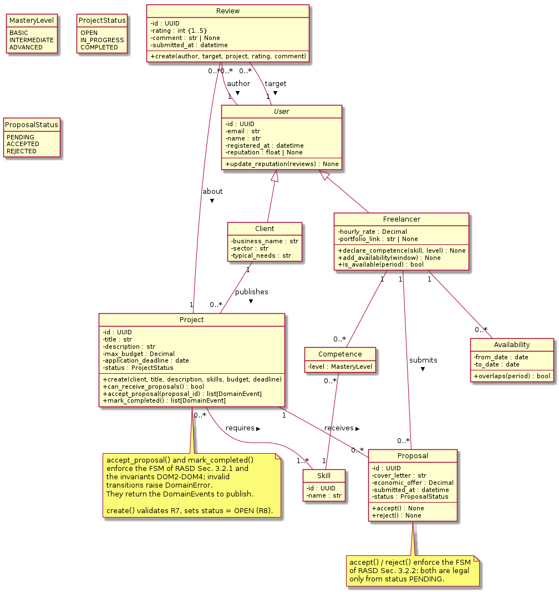
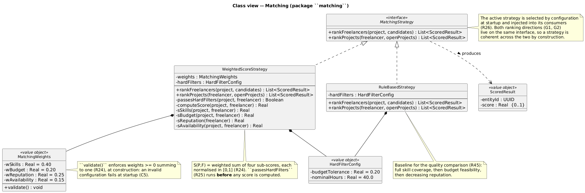
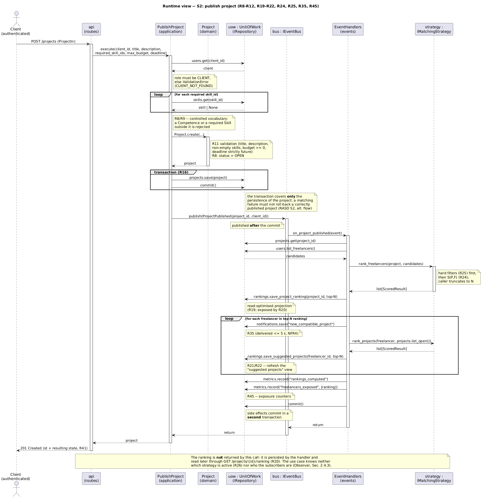
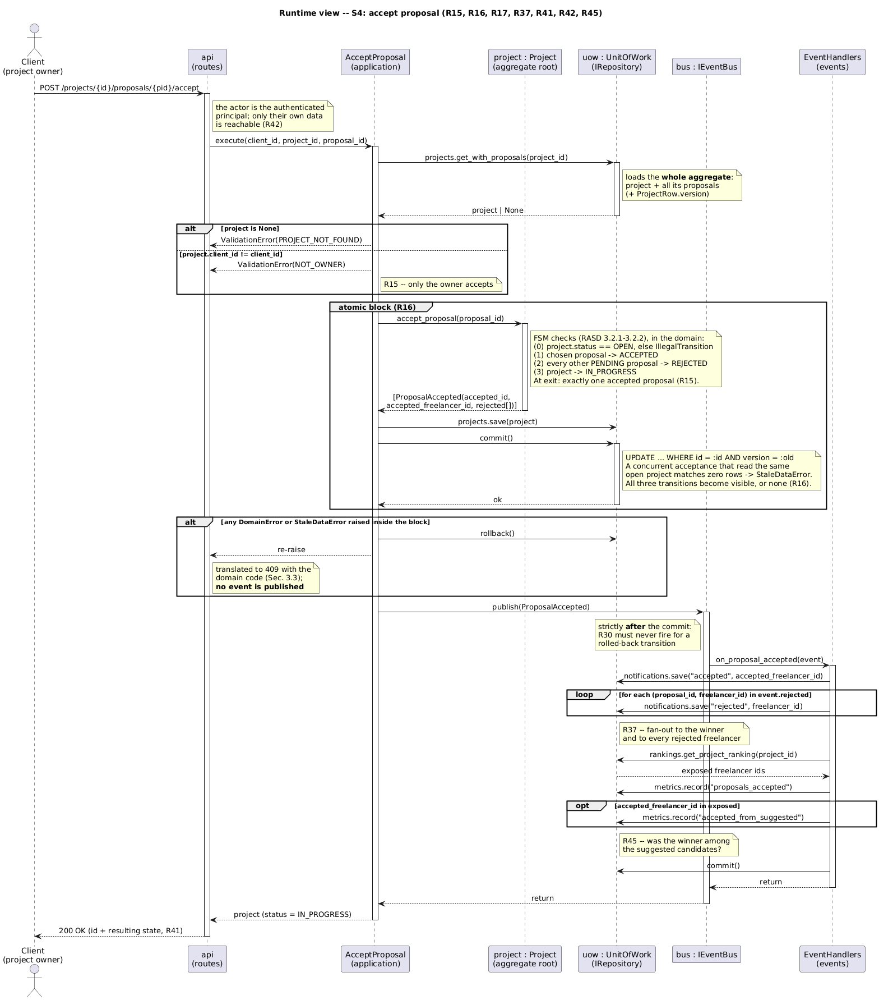

# Design Document

### FreelanceMatch
*A web platform for automatic freelancer–client matching*

---

**Politecnico di Milano**
Software Engineering for Automation — A.Y. 2025-2026

| | |
|---|---|
| **Authors** | Olmo Luca (10838404), Palladino Antonio (10778757), Pensotti Francesca (10777621) |
| **Repository** | `https://github.com/<owner>/SE4A_LucaOlmo_AntonioPalladino_FrancescaPensotti` |

---

## Table of contents

- [1. Introduction](#1-introduction)
  - [1.1 Purpose](#11-purpose)
  - [1.2 Definitions, Acronyms, Abbreviations](#12-definitions-acronyms-abbreviations)
  - [1.3 Revision history](#13-revision-history)
  - [1.4 Document structure](#14-document-structure)
- [2. Architectural Design](#2-architectural-design)
  - [2.1 Component view](#21-component-view)
  - [2.2 Class view](#22-class-view)
  - [2.3 Runtime view](#23-runtime-view)
  - [2.4 Selected architectural styles and patterns](#24-selected-architectural-styles-and-patterns)
- [3. User Interface Design](#3-user-interface-design)
- [4. Requirements Traceability](#4-requirements-traceability)
- [5. Implementation, Integration and Test Plan](#5-implementation-integration-and-test-plan)
- 6. References *(TBD)*

---

## 1. Introduction

### 1.1 Purpose

This document describes the design of FreelanceMatch, whose requirements are specified in the Requirements Analysis and Specification Document (RASD). While the RASD answers the question of *what* the system must do (its goals (G1–G6), its functional requirements (R1–R32) and the qualities it must exhibit (NFR1–NFR17)),  this document answers the question of *how* the system is organised to do it.

The main goals of the project, stated in full in RASD Sec. 1.1, are recalled here in compact form to keep this document self-contained:

- **G1/G2** — bidirectional automatic matching: ranked freelancers for every published project, ranked projects for every registered freelancer;
- **G3** — management of the full project lifecycle with the constraints of each phase;
- **G4** — reputation derived from mutual reviews, fed back into the matching;
- **G5** — replaceability of the matching algorithm without changes to the rest of the system;
- **G6** — manual search complementary to the automatic matching.

The design presented here is organised around three architectural decisions, each anticipated in the RASD and motivated in Sec. 2.4 of this document: a *Strategy* interface that isolates the matching algorithm (G5, R20, NFR15); an *Observer*-based event mechanism that decouples lifecycle transitions from their side effects (notifications, ranking recomputation); and a *Repository* layer that abstracts data access so that the domain logic can be tested against in-memory implementations.

The target implementation, described in Sec. 5, is a Python web service exposing a REST API (FastAPI) backed by a relational store (SQLite via SQLAlchemy); the system is delivered API-first, with the auto-generated OpenAPI interface serving as the demonstration UI (see Sec. 3).

### 1.2 Definitions, Acronyms, Abbreviations

The definitions of the domain terms (Client, Freelancer, Project, Proposal, Review, Reputation, Matching, Compatibility score *S(P,F)*, etc.) are given in RASD Sec. 1.3.1 and are not repeated here. The following additional terms are specific to this document.

| Term | Definition |
|---|---|
| **Component** | A unit of the system with a well-defined responsibility and an explicit interface towards the other components. In this design, components correspond to Python packages. |
| **Use case (application service)** | The orchestration of a single user-triggered flow (one of the scenarios S1–S6 of RASD Sec. 2.1), implemented as one application-layer module that coordinates domain entities, repositories and events. |
| **Event bus** | The in-process publish/subscribe mechanism through which lifecycle events are propagated to their observers. |
| **Domain layer** | The set of entities, value objects and invariants of RASD Sec. 2.2, implemented without dependencies on frameworks, persistence or transport. |
| **DTO** | Data Transfer Object: the request/response schema exposed by the REST API, distinct from the domain entities. |

| Acronym | Meaning |
|---|---|
| DD | Design Document |
| RASD | Requirements Analysis and Specification Document |
| API | Application Programming Interface |
| REST | Representational State Transfer |
| ORM | Object-Relational Mapping |
| FSM | Finite State Machine |

### 1.3 Revision history

| Version | Date | Notes |
|---------|------|-------|
| 0.1 | 2026-06-12 | Section 1-2 |

### 1.4 Document structure

**Section 2 (Architectural Design)** presents the architecture from four complementary points of view: the component view (Sec. 2.1) identifies the components, their responsibilities and the interfaces they export; the class view (Sec. 2.2) refines the most relevant components into class diagrams; the runtime view (Sec. 2.3) shows how the components interact to accomplish the main scenarios of the RASD; Sec. 2.4 names and motivates the architectural styles and design patterns adopted.

**Section 3 (User Interface Design)** describes the interface through which the system is operated, which in this API-first delivery is the auto-generated OpenAPI (Swagger) console.

**Section 4 (Requirements Traceability)** maps the requirements R1–R32 of the RASD onto the design elements introduced in Section 2, extending the traceability matrix of RASD Sec. 2.4.7.

**Section 5 (Implementation, Integration and Test Plan)** defines the order in which the components will be implemented, the order in which they will be integrated, and the strategy for testing the integration.

**Section 6 (References)** lists the sources cited in this document.

---

## 2. Architectural Design

### 2.1 Component view

Figure 1 shows the components of the system and the dependencies between them. The architecture is layered: each component belongs to one of four layers — presentation, application, domain, infrastructure — and dependencies point inward, towards the domain. The domain layer has no outgoing dependency: it does not know how it is stored, how it is exposed over the network, or which concrete matching algorithm is active. This direction of dependencies is the single most important property of the architecture, because it is what makes the three replaceability requirements of the RASD (R20/NFR15 for the matching strategy, DEP1/Sec. 2.6.2 for the data store) achievable without touching the domain logic.

The components, their responsibilities and the interfaces they export are described below. Component names correspond one-to-one to the Python packages of the implementation (Sec. 5), so that the mapping between this document and the source tree is direct.

#### 2.1.1 API Gateway (`api`)

The single entry point of the system. It exposes the REST interface described by the auto-generated OpenAPI specification (Sec. 3), translates HTTP requests into invocations of the application-layer use cases, and translates the results (or the domain errors) back into HTTP responses with the appropriate status codes. The component contains no business logic: every rule lives in the layers below. 

#### 2.1.2 Use Cases (`application`)

One module per scenario of RASD Sec. 2.1: `register_user` (S1), `publish_project` (S2), `submit_proposal` (S3), `accept_proposal` (S4), `complete_and_review` (S5), `manual_search` (S6). Each use case orchestrates the same four collaborators: it loads and saves entities through **IRepository**, invokes the active matching algorithm through **IMatchingStrategy** when needed, mutates the domain entities (which enforce their own invariants), and publishes lifecycle events through **IEventBus**. The use case layer is also where transactional boundaries are drawn: the atomic block of R12 (acceptance + cascading rejections + project transition) is delimited here, around the corresponding repository operations (NFR6).

#### 2.1.3 Domain Model (`domain`)

The implementation of the entities and invariants of RASD Sec. 2.2: `User` (with `Client` and `Freelancer`), `Skill`, `Competence`, `Availability`, `Project`, `Proposal`, `Review`. State transitions follow exactly the finite state machines of RASD Sec. 3.2; invalid transitions and violations of the invariants DOM1–DOM7 raise domain errors that the upper layers translate into user-facing failures. The component depends on nothing: it is plain Python, importable and testable in isolation.

#### 2.1.4 Matching (`matching`)

The implementation of the matching procedure behind the **IMatchingStrategy** interface (R20). The interface exposes a single operation, `rank(project, candidates) → ordered list of (freelancer, score)`, plus its symmetric counterpart for the freelancer-side ranking. Two concrete strategies are provided: `WeightedScoreStrategy`, implementing the score S(P,F) of R18 with its four weighted sub-scores and the hard filters of R19; and `RuleBasedStrategy`, the sequential-criteria baseline used for the quality comparison described in the project proposal (NFR16). The active strategy is selected by configuration at startup; adding a third strategy requires implementing the interface and registering it, with no change to any other component (NFR15).

#### 2.1.5 Event Bus (`events`)

The in-process publish/subscribe mechanism behind the **IEventBus** interface. Use cases publish typed lifecycle events — `ProjectPublished`, `ProposalReceived`, `ProposalAccepted`, `CollaborationCompleted`, `ProfileUpdated` — and handlers registered at startup react to them: notification creation (R28–R31), ranking recomputation on profile updates (R16, R17), reputation refresh on review submission (R27). The publisher does not know its subscribers; adding a new side effect to an existing event means adding a new handler, not modifying the use case that publishes it.

#### 2.1.6 Repositories (`repositories`)

The data-access layer behind the **IRepository** interface family (one repository per aggregate: users, projects, proposals, reviews, notifications, skills). Two implementations are provided: the SQLite/SQLAlchemy implementation used at runtime, and an in-memory implementation used by the test suite, which makes the domain and application layers testable without a database (the rationale anticipated in RASD Sec. 2.6.2/DEP1). The repository layer is the only component allowed to touch the database.

#### 2.1.7 Dependency rules

The dependency rules, visible as arrow directions in Figure 1, are summarised below; they will be enforced during implementation by the package import structure.

| Component | May depend on | Must not depend on |
|---|---|---|
| `api` | `application` | `domain`, `matching`, `events`, `repositories` directly |
| `application` | `domain`, and the three interfaces (`IMatchingStrategy`, `IEventBus`, `IRepository`) | concrete implementations in `matching`, `events`, `repositories` |
| `domain` | nothing | everything else |
| `matching` | `domain` | `application`, `api`, `repositories` |
| `events` | `domain` (event payloads) | `api` |
| `repositories` | `domain` | `application`, `api`, `matching` |

### 2.2 Class view

This section refines two of the components introduced in Sec. 2.1 down to the class level: the Domain Model and the Matching component. These two are the ones whose internal structure carries actual design decisions; the remaining components (API Gateway, Use Cases, Event Bus, Repositories) are intentionally thin — their structure is one module per responsibility, fully described by Sec. 2.1 and by the runtime view of Sec. 2.3, and a class diagram would add no information.

#### 2.2.1 Domain Model

Figure 2 shows the classes of the `domain` package. The diagram is the implementation-level refinement of the conceptual domain model of RASD Sec. 2.2: the entities, associations and multiplicities are unchanged, and the refinement consists of (i) concrete attribute types, (ii) the behavioural methods that each entity exposes, and (iii) the explicit enumerations backing the `status` attributes.

The key design decision in this diagram is that **state transitions are methods of the entities themselves**, not procedures of the application layer. `Project.accept_proposal()` and `Project.mark_completed()` implement the FSM of RASD Sec. 3.2.1; `Proposal.accept()` and `Proposal.reject()` implement the FSM of RASD Sec. 3.2.2. Each method checks the current state and raises a `DomainError` when the requested transition is not legal. For instance, `accept_proposal()` on a project whose status is not `OPEN` fails before any side effect occurs. This placement guarantees that the invariants DOM1–DOM7 cannot be bypassed: there is no code path that mutates a `status` attribute directly, so any caller, present or future, goes through the validating methods.

Transition methods return the list of `DomainEvent`s that the transition implies (e.g. `accept_proposal()` returns a `ProposalAccepted` event carrying the identifiers of the accepted and rejected proposals). The entity *decides* which events occurred; the application layer *publishes* them on the event bus after the transaction commits. This split keeps the domain free of any dependency on the event infrastructure while still making the entity the single source of truth for what happened.

`User.reputation` is stored as a plain attribute and recomputed by `update_reputation(reviews)` upon submission of a new review (R27, DOM7), rather than being recalculated on every read: the trade-off favours read performance (reputation is read by every matching computation) at the negligible cost of one extra write per review.

#### 2.2.2 Matching

Figure 3 shows the classes of the `matching` package, the concrete realisation of the *Strategy* pattern required by R20/NFR15.

`MatchingStrategy` is the interface the application layer depends on. It exposes the two ranking directions of G1/G2 as separate operations — `rank_freelancers(project, candidates)` and `rank_projects(freelancer, open_projects)` — both returning ordered lists of scored results, truncated to the configured length *N* by the caller.

`WeightedScoreStrategy` is the default implementation and realises the score S(P,F) of R18. The four sub-scores (`s_skills`, `s_budget`, `s_reputation`, `s_availability`) are private methods, each normalised in [0,1]; `compute_score` combines them with the weights held by the `MatchingWeights` value object, whose `validate()` enforces that the weights sum to one. Hard filters (R19) are applied before any score is computed, so excluded candidates never enter the scoring loop. Keeping the weights in a separate value object (rather than as constructor arguments) gives the administrator-facing configuration of RASD C5 a single, validated home.

`RuleBasedStrategy` is the second implementation, used as the comparison baseline for the matching-quality assessment (NFR16): it ranks by sequential criteria the full skill coverage first, then budget feasibility, then decreasing reputation without any weighted combination.

The active strategy is chosen by configuration at application startup and injected into the use cases that need it (S2 publication, S6 search ordering, profile-update recomputations). No component other than the startup wiring knows which concrete class is active; replacing or adding a strategy therefore satisfies NFR15 by construction.

### 2.3 Runtime view

This section shows how the components of Sec. 2.1 collaborate at runtime to accomplish the main scenarios of the system. The same selection criterion of RASD Sec. 3.1 applies, now at the design level: a runtime diagram is included only for the flows in which the *internal* collaboration between components carries design decisions that the component view alone cannot show. These are, again, S2 (project publication, where the matching strategy and the event propagation enter the picture) and S4 (proposal acceptance, where the transactional boundary is the decision). The remaining scenarios follow the same uniform pattern — `api` → use case → repository (→ event bus) — with no variation worth a dedicated diagram.

Both diagrams use the components of Sec. 2.1 as lifelines, with the application layer depending only on the three interfaces (`IRepository`, `IMatchingStrategy`, `IEventBus`); the concrete implementations behind them are interchangeable, as discussed in Sec. 2.4.

#### 2.3.1 S2 — Project publication

Figure 4 shows the runtime interaction for the publication of a project (RASD scenario S2, requirements R7, R8, R15, R16, R18, R19, R28).

Three design decisions are visible in the diagram. First, **validation happens in the domain**: `Project.create(...)` enforces R7 (mandatory fields, deadline in the future, budget ≥ 0) and sets the initial state per R8; the use case never constructs a `Project` in an invalid state. Second, **the ranking computation goes through `IMatchingStrategy`**: the use case does not know whether the active strategy is the weighted-score or the rule-based one, which is the operational meaning of R20. Third, **side effects are observer-driven**: the use case publishes a single `ProjectPublished` event and terminates; the notification fan-out (R28) and the refresh of the freelancer-side suggested view (R16) happen in handlers subscribed to that event. Adding a further side effect to project publication — e.g. an audit log — would mean registering one more handler, with no change to `publish_project`.

The transaction in this flow covers only the persistence of the new project. The ranking computation runs after the commit: a failure in the matching must not roll back a correctly published project; in the worst case the ranking is recomputed on the next profile-update event, and the project remains visible in the catalogue for manual applications (consistently with the "empty ranking" alternative flow of RASD S2).

#### 2.3.2 S4 — Proposal acceptance

Figure 5 shows the runtime interaction for the acceptance of a proposal (RASD scenario S4, requirements R11, R12, R13, R30, NFR6).

This is the flow where the transactional design decision lives, and the diagram makes its boundaries explicit. The atomic block of R12 starts when the use case loads the project together with its proposals, and ends with the single `projects.save(project)` commit. Inside the block, the entire decision logic is delegated to the domain: `Project.accept_proposal(proposal_id)` performs the FSM checks of RASD Sec. 3.2.1–3.2.2 and applies the three transitions (chosen proposal → `ACCEPTED`, every other pending proposal → `REJECTED`, project → `IN_PROGRESS`) on the in-memory aggregate. The repository then persists the aggregate in one commit: either all three transitions become visible, or none does (NFR6). Concurrent acceptance attempts are serialised at this commit point — the second transaction finds the project no longer `OPEN` and the domain check fails, which is the design-level realisation of the "concurrent acceptance" exception flow of RASD S4.

The `ProposalAccepted` event is published **after** the commit, never inside the transaction. This ordering rules out the failure mode in which freelancers receive acceptance or rejection notifications (R30) for a transition that was subsequently rolled back. The trade-off is the opposite, narrower failure mode — a crash between commit and publish would lose the notifications — which is acceptable for in-app notifications that the user can in any case derive from the dashboard state (R32).

### 2.4 Selected architectural styles and patterns

This section names the architectural style and the design patterns adopted, and for each of them explains *why* it was selected — i.e. which requirement or quality of the RASD it serves — and *how* it is realised in the components of Sec. 2.1–2.3. The three patterns below are the ones anticipated in the project proposal; the layered style is the frame that holds them together.

#### 2.4.1 Layered architecture (style)

**Which.** The system is organised in four layers — presentation, application, domain, infrastructure — with dependencies pointing inward towards the domain, as shown in the component view (Sec. 2.1) and enforced by the dependency rules of Sec. 2.1.7. The domain layer depends on nothing; the infrastructure implements interfaces declared for the inner layers' benefit.

**Why.** Two reasons, both traceable to the RASD. First, the replaceability requirements: R20/NFR15 (matching strategy) and the data-store abstraction of Sec. 2.6.2/DEP1 both demand that a concrete mechanism can be swapped without touching the business logic, which is achievable only if the business logic does not reference concrete mechanisms in the first place. Second, testability: NFR-level conformance (in particular the invariants DOM1–DOM7 and the FSM transitions) must be verifiable by the test suite without a database or a web server, which requires a domain layer importable in isolation.

**How.** Each layer is one or more Python packages (`api`, `application`, `domain` + `matching` + `events`, `repositories`). The inward dependency rule is realised through three interfaces owned by the inner layers and implemented by the outer ones: `IRepository`, `IMatchingStrategy`, `IEventBus`. The concrete implementations are wired at application startup (composition root in `main.py`) and injected into the use cases; no module below the startup wiring imports a concrete implementation.

#### 2.4.2 Strategy — replaceable matching algorithm

**Which.** The *Strategy* pattern applied to the matching procedure: the interface `MatchingStrategy` (Sec. 2.2.2) with two interchangeable implementations, `WeightedScoreStrategy` (default, the score model S(P,F) of R18 with the hard filters of R19) and `RuleBasedStrategy` (the sequential-criteria baseline).

**Why.** This is the direct realisation of goal G5 and of its requirement form R20/NFR15: the matching algorithm is the part of the system most likely to evolve — the project proposal itself plans a quality comparison between the two strategies (NFR16) — and the rest of the system must be insulated from that evolution. Without the pattern, every experiment on the ranking logic would risk regressions in project lifecycle, notifications and reviews.

**How.** The use cases that need a ranking (`publish_project`, `manual_search`, the profile-update handlers) receive a `MatchingStrategy` instance through their constructor; the active implementation is chosen by a configuration key read at startup. The two ranking directions (G1: freelancers for a project; G2: projects for a freelancer) are two operations of the same interface, so a strategy is always coherent across both directions. Adding a third strategy consists of one new class implementing the interface plus one new value for the configuration key, no other file changes.

#### 2.4.3 Observer — decoupled reaction to lifecycle events

**Which.** The *Observer* pattern, realised as an in-process event bus (`IEventBus`, Sec. 2.1.5): use cases publish typed domain events — `ProjectPublished`, `ProposalReceived`, `ProposalAccepted`, `CollaborationCompleted`, `ProfileUpdated` — and handlers registered at startup react to them.

**Why.** The lifecycle transitions of the system have one-to-many side effects: a single acceptance (S4) must close the other proposals' lifecycle, notify the chosen freelancer and notify every rejected one (R30); a single publication (S2) must notify the ranked freelancers (R28) and refresh their suggested views (R16); a profile update must recompute rankings on both sides (R16, R17). Hard-wiring these effects into the use cases would make every new side effect a modification of tested code; the Observer inverts this, making new effects additive. The pattern is also what keeps the runtime view of Sec. 2.3 honest: the publisher terminates after `publish(event)` and genuinely does not know its subscribers.

**How.** The event bus is a registry mapping event types to lists of handler callables, populated in the composition root. Events are plain immutable dataclasses produced *by the domain entities* as return values of their transition methods (Sec. 2.2.1) and published *by the use cases* strictly after the transaction commit (Sec. 2.3.2), which fixes the ordering guarantee discussed there. Handlers live in the `events` package and use the same repository interfaces as the use cases.

#### 2.4.4 Repository — data access decoupled from domain logic

**Which.** The *Repository* pattern: one repository interface per aggregate (users, projects, proposals, reviews, notifications, skills) declared next to the domain, with two implementations — SQLAlchemy/SQLite for runtime, in-memory dictionaries for the test suite.

**Why.** Anticipated in RASD Sec. 2.6.2/DEP1 for exactly the reason it is adopted here: the correctness of the matching and of the lifecycle logic must be verifiable against controlled, reproducible data sets. An in-memory implementation makes every domain and application test run in milliseconds with no setup; the SQLite implementation carries the transactional guarantees that the atomic block of R12 requires (NFR6). The pattern also implements constraint C2 of the layered style: the repository layer is the only code allowed to touch the database, so a future migration from SQLite to PostgreSQL is confined to one package and one connection string.

**How.** Each repository interface exposes aggregate-oriented operations (`get`, `get_with_proposals`, `save`, `list_open`, …) rather than generic CRUD on rows: the unit of loading and saving is the aggregate that the domain methods operate on — e.g. `projects.get_with_proposals()` returns a `Project` together with its `Proposal`s precisely because `Project.accept_proposal()` needs to transition them together inside one atomic block (Sec. 2.3.2). The SQLAlchemy implementation maps the domain entities to tables; the mapping is kept in the `repositories` package so that the `domain` package remains free of ORM imports.
## 3. User Interface Design

### 3.1 Approach: API-first delivery

The system is delivered API-first, consistently with constraint C1 of the RASD (web application, no native clients) and with the prototype scope of Deliverable 3. The user-facing surface of this iteration is the REST API itself, operated through the **OpenAPI (Swagger) console** that FastAPI generates automatically from the endpoint definitions and serves at the `/docs` path.

This choice is a deliberate allocation of effort, not an omission. The interesting engineering content of FreelanceMatch — the matching strategies, the lifecycle invariants, the event-driven side effects — lives entirely behind the API boundary; a custom graphical frontend would exercise none of it and would consume a significant share of the implementation budget. The OpenAPI console, by contrast, costs zero implementation effort and provides everything the demonstration and the evaluation need: every endpoint is listed with its request/response schemas, can be invoked interactively from the browser, and displays the actual responses of the running system. A custom frontend remains a natural extension and would interact with the very same API, with no server-side change.

### 3.2 Structure of the interface

The console groups the endpoints by tag; tags correspond one-to-one to the requirement clusters of RASD Sec. 2.4, so that the interface itself mirrors the structure of the requirements:

| Tag | Endpoints (main) | Requirements cluster |
|---|---|---|
| **accounts** | `POST /users` (register), `POST /login`, `GET/PUT /users/me` (profile), `GET /skills`, `POST /skills/requests` | R1–R6 |
| **projects** | `POST /projects`, `GET /projects/{id}`, `POST /projects/{id}/complete` | R7, R8, R14 |
| **proposals** | `POST /projects/{id}/proposals`, `POST /projects/{id}/proposals/{pid}/accept` | R9–R13 |
| **matching** | `GET /projects/{id}/ranking`, `GET /users/me/suggested-projects` | R15–R20 |
| **search** | `GET /search/freelancers`, `GET /search/projects` | R21–R23 |
| **reviews** | `POST /projects/{id}/reviews` | R24–R27 |
| **notifications** | `GET /users/me/notifications`, `GET /users/me/dashboard` | R28–R32 |
| **metrics** | `GET /metrics/matching` | NFR16 |

The table lists the main endpoints per cluster; the complete and authoritative list is the auto-generated OpenAPI console.
### 3.3 Interaction conventions

The conventions below realise, at the API level, the usability requirements stated for the interface in the RASD:

- **Explicit outcome feedback (NFR9).** Every state-changing endpoint returns the affected entity with its new state in the response body (e.g. accepting a proposal returns the project with `status = IN_PROGRESS` and the proposal with `status = ACCEPTED`), so the caller always observes the outcome of the action.
- **Errors as structured responses.** Domain errors (FSM violations, invariant violations DOM1–DOM7, validation failures) are translated by the API Gateway into HTTP `409 Conflict` or `422 Unprocessable Entity` with a machine-readable body `{ "error": <code>, "detail": <message> }`; the error codes reuse the invariant identifiers (e.g. `DOM1_DUPLICATE_PROPOSAL`), keeping the vocabulary of the documents and of the running system aligned (NFR10).
- **Identity.** For the prototype, the authenticated user is conveyed by a session token obtained from `POST /login`; endpoints under `/users/me/...` resolve the identity from the token (NFR14).

### 3.4 Walkthrough of the demonstration flow

The demonstration of the system follows the scenario chain S1→S5 of the RASD directly on the console: register a client and a freelancer (S1), publish a project and inspect the returned ranking (S2), submit a proposal as the freelancer (S3), accept it as the client and observe the cascading state changes (S4), complete the project and exchange reviews, observing the reputation update (S5). A seed script (Sec. 5) pre-populates the database with a realistic catalogue of skills and freelancers so that the rankings computed during the demonstration are meaningful.
## 4. Requirements Traceability

This section maps the functional requirements R1–R32 of the RASD onto the design elements introduced in Section 2, extending the traceability matrix of RASD Sec. 2.4.7 with the design columns. For each requirement, the matrix indicates the use case (application module) that orchestrates it and the design element — component, class or method — that realises its core logic. The non-functional requirements with a direct design counterpart are traced in the closing paragraph.

| Req. | Use case (application) | Design element (component — class/method) |
|------|------------------------|--------------------------------------------|
| R1   | `register_user` | `domain — User` subclass creation; `api — POST /users` |
| R2   | `register_user` | `repositories — UserRepository.exists_by_email()` |
| R3   | `register_user` / profile update | `domain — Client` profile fields |
| R4   | `register_user` / profile update | `domain — Freelancer.declare_competence()`, `add_availability()` |
| R5   | profile update | `repositories — UserRepository.save()`; `events — ProfileUpdated` |
| R6   | `register_user` | `domain — Skill` catalogue; `repositories — SkillRepository` |
| R7   | `publish_project` | `domain — Project.create()` validation |
| R8   | `publish_project` | `domain — Project.create()` → `status = OPEN` |
| R9   | `submit_proposal` | `domain — Project.can_receive_proposals()` |
| R10  | `submit_proposal` | `repositories — ProposalRepository` uniqueness check (DOM1) |
| R11  | `accept_proposal` | `domain — Project.accept_proposal()` precondition |
| R12  | `accept_proposal` | `domain — Project.accept_proposal()` inside the transactional block (Sec. 2.3.2) |
| R13  | `submit_proposal` | `domain — Project.can_receive_proposals()` (status ≠ OPEN → refuse) |
| R14  | `complete_and_review` | `domain — Project.mark_completed()` |
| R15  | `publish_project` | `matching — MatchingStrategy.rank_freelancers()` |
| R16  | events handler | `events — on_profile_updated` → `rank_projects()` |
| R17  | events handler | `events — on_profile_updated` → recompute open-project rankings |
| R18  | — | `matching — WeightedScoreStrategy.compute_score()` + sub-score methods |
| R19  | — | `matching — WeightedScoreStrategy` hard-filter pre-pass |
| R20  | all ranking call sites | `matching — MatchingStrategy` interface + startup wiring (Sec. 2.4.2) |
| R21  | `manual_search` | `repositories — UserRepository.search()`; `api — GET /search/freelancers` |
| R22  | `manual_search` | `repositories — ProjectRepository.search()`; `api — GET /search/projects` |
| R23  | `manual_search` | ordering parameter resolved in `manual_search` |
| R24  | `complete_and_review` | `events — on_collaboration_completed` opens review window |
| R25  | `complete_and_review` | `domain — Review` creation rules (DOM5, DOM6) |
| R26  | `complete_and_review` | `domain — Review` immutability (no update method exists) |
| R27  | `complete_and_review` | `domain — User.update_reputation()`; `events — on_review_submitted` |
| R28  | events handler | `events — on_project_published` → notifications |
| R29  | events handler | `events — on_proposal_received` → notification to owner |
| R30  | events handler | `events — on_proposal_accepted` → accepted/rejected notifications |
| R31  | events handler | `events — on_collaboration_completed` → review-window notifications |
| R32  | dashboard query | `api — GET /users/me/dashboard`; `repositories` read queries |

Beyond the functional requirements, the design directly realises the following non-functional ones. **NFR6** (atomic transitions) is realised by the transactional boundary drawn in the `accept_proposal` use case around the aggregate commit (Sec. 2.3.2). **NFR15** (strategy replaceability) is realised by the `MatchingStrategy` interface and the startup wiring (Sec. 2.4.2) and verified mechanically by the swap test of Sec. 5. **NFR16** (matching quality metrics) is realised by the `RuleBasedStrategy` baseline plus the event handlers, which record ranking exposures and proposal outcomes as they react to the lifecycle events. **NFR11–NFR14** (security) are confined to the `api` component (password hashing at registration, session resolution, per-user data scoping in the `/users/me/...` endpoints), consistently with the layering: no security concern leaks below the presentation layer.

The remaining mappings of requirements to goals, scenarios, shared phenomena and domain invariants are unchanged from RASD Sec. 2.4.7 and are not duplicated here.
## 5. Implementation, Integration and Test Plan

This section defines the order in which the components of Sec. 2.1 will be implemented, the order in which they will be integrated, and the strategy for testing each increment. The plan follows a bottom-up order along the dependency direction of the layered architecture: components are implemented starting from the ones that depend on nothing, so that every increment is testable the moment it is written, without stubs for lower layers.

### 5.1 Implementation order

The implementation proceeds in five increments. Each increment ends with a working, tested state of the repository — never with code that compiles but cannot be exercised.

**Increment 1 — Domain (`domain`).**
The entities, enumerations and transition methods of Sec. 2.2.1, with the invariants DOM1–DOM7 enforced inside the entities. This increment has no dependency and is implemented first precisely because everything else depends on it. Includes the `DomainEvent` dataclasses returned by the transition methods.
*Exit criterion:* the unit-test suite over the domain passes (Sec. 5.3, T1–T2); the FSMs of RASD Sec. 3.2 are fully covered, legal and illegal transitions alike.

**Increment 2 — Matching (`matching`) and in-memory repositories.**
The `MatchingStrategy` interface with both implementations (Sec. 2.2.2), plus the in-memory implementation of the repository interfaces. The in-memory repositories are implemented *before* the SQL ones because they unblock the testing of everything above the domain at negligible cost.
*Exit criterion:* T3–T4 pass; the two strategies produce correct and distinct rankings on a controlled catalogue.

**Increment 3 — Application layer (`application`) and event bus (`events`).**
The six use cases in the order of their scenario dependencies: `register_user` (S1), `publish_project` (S2), `submit_proposal` (S3), `accept_proposal` (S4), `complete_and_review` (S5), `manual_search` (S6, lowest priority — declared nice-to-have and cut first if the schedule demands it). The event bus and the handlers are implemented together with `publish_project`, which is the first use case that needs them.
*Exit criterion:* T5–T6 pass; the full chain S1→S5 runs as a plain Python script against the in-memory repositories.

**Increment 4 — Persistence (`repositories`/SQLAlchemy) and composition root.**
The SQLite implementation of the repository interfaces, the ORM mapping, and the startup wiring (`main.py`) that selects the active matching strategy and registers the event handlers.
*Exit criterion:* T7 passes; the same S1→S5 script of increment 3 runs unmodified against SQLite — the strongest possible evidence that the Repository abstraction holds.

**Increment 5 — API (`api`), seed data, packaging.**
The REST endpoints of Sec. 3.2 (thin translation to use cases), the error mapping of Sec. 3.3, the seed script, the installation instructions. This is last because it adds no logic: every behaviour it exposes already exists and is already tested.
*Exit criterion:* T8 passes; the demonstration walkthrough of Sec. 3.4 can be executed end-to-end on the Swagger console after a fresh clone-and-install.

### 5.2 Integration order

Integration follows the increments: each increment integrates with the already-tested stack below it, so there is no "big-bang" integration phase. The two integration points that deserve explicit attention are:

1. **Application ↔ Persistence (increment 4).** The switch from in-memory to SQLite repositories is the moment when the transactional semantics of NFR6 becomes real. The integration test T7 exercises the atomic block of `accept_proposal` against SQLite specifically, including the concurrent-acceptance race (two acceptances of different proposals on the same project: exactly one must succeed).
2. **API ↔ Application (increment 5).** Verified by end-to-end tests that drive the HTTP interface (FastAPI's test client) through the S1→S5 chain and assert on the HTTP-level contract: status codes, error bodies with DOM-coded errors, state visible in responses (NFR9).

### 5.3 Test plan

Testing is organised in three levels — unit (domain, matching), integration (use cases against both repository implementations), end-to-end (HTTP) — with the suite below as the committed minimum. Tests are written together with the increment they verify, not deferred to the end.

| Id | Level | What it verifies | Traces to |
|----|-------|------------------|-----------|
| T1 | unit | Every invariant DOM1–DOM7: one test per invariant attempting the violation and expecting `DomainError` | RASD Sec. 2.2 |
| T2 | unit | FSM transition coverage for `Project` and `Proposal`: all legal transitions succeed, all illegal ones fail | RASD Sec. 3.2; R8–R14 |
| T3 | unit | `WeightedScoreStrategy`: sub-scores normalised in [0,1], weights validated, hard filters exclude before scoring, known catalogue → known ranking | R18, R19 |
| T4 | unit | Strategy swap: identical input through both strategies yields valid but distinct rankings; active strategy switchable by configuration alone | R20, NFR15, G5 |
| T5 | integration | Use-case chain S1→S5 on in-memory repositories: full lifecycle with assertions on intermediate states and emitted events | S1–S5; R1–R31 |
| T6 | integration | Observer effects: `ProjectPublished` produces notifications + suggested-view refresh; `ProposalAccepted` produces accepted/rejected notifications; handlers receive events only after commit | R16, R28–R31 |
| T7 | integration | Atomic acceptance on SQLite: cascade correctness and concurrent-acceptance race (exactly one winner) | R12, DOM2, DOM3, NFR6 |
| T8 | end-to-end | HTTP walkthrough of Sec. 3.4 via test client: status codes, DOM-coded error bodies, per-user data scoping | NFR9, NFR10, NFR14 |
