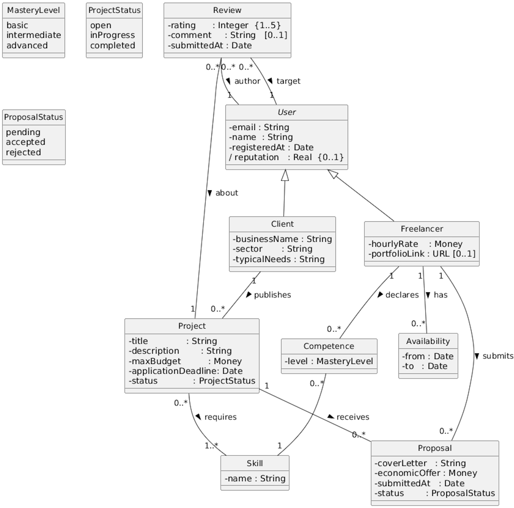

# Requirements Analysis and Specification Document

### FreelanceMatch
*A web platform for automatic freelancer–client matching*

---

**Politecnico di Milano**
Software Engineering for Automation — A.Y. 2025-2026

| | |
|---|---|
| **Authors** | Olmo Luca (10838404), Palladino Antonio (10778757), Pensotti Francesca (10777621) |
| **Repository** | `https://github.com/<owner>/SE4A_Olmo_Palladino_Pensotti` |

---

## Table of contents

- [1. Introduction](#1-introduction)
  - [1.1 Purpose](#11-purpose)
  - [1.2 Scope](#12-scope)
    - [1.2.1 World and machine](#121-world-and-machine)
    - [1.2.2 Shared phenomena](#122-shared-phenomena)
  - [1.3 Definitions, Acronyms, Abbreviations](#13-definitions-acronyms-abbreviations)
    - [1.3.1 Definitions](#131-definitions)
    - [1.3.2 Acronyms and abbreviations](#132-acronyms-and-abbreviations)
  - [1.4 Document structure](#14-document-structure)
- [2. Overall description](#2-overall-description)
  - [2.1 Scenarios](#21-scenarios)
  - [2.2 Domain model](#22-domain-model)
  - [2.3 User characteristics](#23-user-characteristics)
  - [2.4 Product functions](#24-product-functions)
  - [2.5 Non-functional aspects](#25-non-functional-aspects)
  - [2.6 Assumptions, dependencies and constraints](#26-assumptions-dependencies-and-constraints)
- 3\. Additional models *(TBD)*
  - 3.1 Requirements-level sequence diagrams
  - 3.2 Finite state machines
- 4\. References *(TBD)*

## 1. Introduction

### 1.1 Purpose

FreelanceMatch is a web-based platform that mediates the encounter between freelance professionals and clients seeking to commission specific work. The problem the system addresses is the inefficiency of the manual search-and-filter workflow imposed by existing platforms (e.g., Upwork, Fiverr), where both sides must invest non-trivial time in sifting through profiles or postings before any contact can occur.

The system replaces (and, optionally, complements) this manual workflow with an automatic matching procedure: when a client publishes a project, the system computes a compatibility score for every available freelancer and presents a ranked shortlist; symmetrically, every freelancer receives a ranked list of projects whose requirements are compatible with their declared profile. Beyond the matching core, the platform manages the entire project lifecycle — from publication, through application and acceptance, to completion and mutual review — and maintains a reputation signal that feeds back into subsequent matches.

The high-level goals of the project are listed below; each goal is later refined into one or more functional requirements (Sec. 2.4) and traced from the corresponding scenarios (Sec. 2.1).

- **G1** — The system shall produce, for each published project, a ranked list of candidate freelancers ordered by a compatibility score that combines skills, budget, reputation and availability.
- **G2** — The system shall produce, for each registered freelancer, a ranked list of open projects compatible with the freelancer's declared profile.
- **G3** — The system shall manage the full lifecycle of a project, from publication to completion and review, enforcing the constraints of each phase (e.g., a client can accept at most one proposal per project; a project under way no longer accepts proposals).
- **G4** — The system shall maintain, for each user, a reputation derived from the reviews received at the end of past collaborations, and shall make this reputation available as an input to the matching procedure.
- **G5** — The matching procedure shall be replaceable with alternative algorithms (e.g., a rule-based ranker) without altering the rest of the system.
- **G6** — The system shall provide both clients and freelancers with a manual search facility, complementary to the automatic matching, so that a user can override the suggested ranking when desired.

### 1.2 Scope

This section describes who interacts with the system and what is exchanged at its boundary. We separate the *world*, i.e. the actors and processes outside the platform, from the *machine*, i.e. the platform itself.

#### 1.2.1 World and machine

The world includes:

- **Clients**, who publish projects and choose the freelancer they want to work with.
- **Freelancers**, who maintain a profile, look at the projects available, and apply to those they are interested in.

The machine — FreelanceMatch — is the web platform that stores profiles and projects, computes the matching, shows ranked lists to the users, and keeps track of proposals, accepted collaborations, reviews and reputations.

#### 1.2.2 Shared phenomena

The points of contact between the world and the machine are listed below. We distinguish actions performed by users (`WP`, world phenomena observed by the machine) from actions performed by the system (`MP`, machine phenomena observed by the world).

**Controlled by the world**

- **WP1** — A user signs up and chooses a role (client or freelancer).
- **WP2** — A client publishes a project, providing title, description, required skills, maximum budget and application deadline.
- **WP3** — A freelancer creates or updates the profile (skills with mastery level, hourly rate, availability, portfolio link).
- **WP4** — A freelancer sends a proposal for an open project, with a cover letter and an economic offer.
- **WP5** — A client accepts one of the proposals received.
- **WP6** — A client marks a project as completed.
- **WP7** — A user submits a review at the end of a collaboration.
- **WP8** — A user runs a manual search with filters.

**Controlled by the machine**

- **MP1** — The system shows to a client the ranked list of freelancers suggested for a project.
- **MP2** — The system shows to a freelancer the ranked list of projects compatible with the freelancer profile.
- **MP3** — The system sends notifications when relevant events happen (new compatible project, new proposal, proposal accepted or rejected, project completed, review window opened).
- **MP4** — The system displays a personal dashboard to each user.
- **MP5** — The system updates the reputation of a user when a new review on that user is submitted.

### 1.3 Definitions, Acronyms, Abbreviations

#### 1.3.1 Definitions

| Term | Definition |
|---|---|
| **Client** | A registered user whose role is "client". Clients publish projects and choose which proposal to accept. |
| **Freelancer** | A registered user whose role is "freelancer". Freelancers maintain a profile and apply to the projects they are interested in. |
| **Profile** | The set of attributes describing a registered user. Clients and freelancers have different profile fields. |
| **Skill** | A competence declared by a freelancer in their profile, associated with a mastery level among "basic", "intermediate" and "advanced". |
| **Project** | A work assignment published by a client, characterised by a title, a description, a list of required skills, a maximum budget (in euros) and an application deadline. |
| **Proposal** | A candidacy submitted by a freelancer for a specific project, containing a cover letter and an economic offer (in euros). A freelancer cannot submit more than one proposal per project. |
| **Collaboration** | The relationship between a client and a freelancer that starts when the client accepts a proposal and ends when the project is marked as completed. |
| **Review** | A 1–5 star rating with an optional textual comment, submitted by one of the two parties at the end of a collaboration. A review cannot be edited after submission. |
| **Reputation** | An aggregate value, normalised in `[0,1]`, computed from the reviews received by a user. Users with no reviews are assigned a neutral reputation. |
| **Compatibility score *S(P,F)*** | A number in `[0,1]` expressing how compatible freelancer *F* is with project *P*. It combines four sub-scores: skills coverage, budget, reputation and availability. |
| **Ranking** | The list of freelancers (resp. projects) ordered by *S(P,F)* in decreasing order. |
| **Matching** | The procedure that, given a project (or a freelancer), produces the corresponding ranking. |
| **Notification** | An in-app message delivered to a user when a relevant lifecycle event takes place (see MP3). |

#### 1.3.2 Acronyms and abbreviations

| Acronym | Meaning |
|---|---|
| RASD | Requirements Analysis and Specification Document |
| UML  | Unified Modeling Language |
| FSM  | Finite State Machine |
| WP   | World Phenomenon (controlled by the world) |
| MP   | Machine Phenomenon (controlled by the machine) |
| G    | Goal |
| R    | Functional Requirement |
| NFR  | Non-Functional Requirement |
| DOM  | Domain Assumption |

### 1.4 Document structure

The remainder of this document is organised as follows.

**Section 2 (Overall description)** presents the requirements at a moderate level of detail. It opens with informal scenarios that illustrate, from the user's perspective, the typical interactions with the platform (Sec. 2.1). It then formalises the entities and relationships of the application domain through a class diagram (Sec. 2.2), characterises the user classes (Sec. 2.3), enumerates the product's functional requirements (Sec. 2.4) and non-functional requirements (Sec. 2.5), and concludes with the assumptions, dependencies and constraints under which the requirements are valid (Sec. 2.6).

**Section 3 (Additional models)** refines the requirements where useful with UML sequence diagrams at the requirements level (Sec. 3.1) and finite state machines for the entities whose lifecycle is non-trivial, in particular `Project` and `Proposal` (Sec. 3.2).

**Section 4 (References)** lists the external sources cited throughout the document.

---

## 2. Overall description

### 2.1 Scenarios

This section describes the main interaction flows between FreelanceMatch and its actors. Each scenario is presented as a structured flow rather than as a narrative: it lists the actor that triggers it, the preconditions under which the flow can be executed, the main sequence of steps performed by the actor and by the system, the postconditions after a successful execution, and the relevant alternative or exception flows. Each step is annotated with the shared phenomena (`WP`/`MP`, see Sec. 1.2.2) that it exercises, so that the trace from the boundary description to the requirements (Sec. 2.4) is explicit.

The scenarios cover the lifecycle of the system from registration to review and span both directions of the matching (client-driven and freelancer-driven). The scenarios are intentionally separated by responsibility: where two actors interact across time, the flow is split at the system boundary so that each scenario remains driven by a single actor.

#### S1 — Account creation and profile setup

**Primary actor.** Any unregistered visitor.

**Preconditions.** The visitor has access to the public landing page; no authenticated session exists.

**Main flow.**
1. The actor selects a role among `client` and `freelancer` and submits the registration data *(WP1)*.
2. The system validates the data (well-formed email, password complexity, role consistency) and creates a `User` record with an initial neutral reputation `0.5`.
3. The actor completes the role-specific profile fields *(WP3)*: a `Client` provides business name, sector and typical needs; a `Freelancer` provides one or more `Competence`s (each pointing to a `Skill` with a mastery level), the hourly rate, one or more `Availability` windows and an optional portfolio link.
4. The system persists the profile and indexes it for use by the matching procedure (Sec. 2.2).

**Postconditions.** The actor holds an authenticated session bound to the chosen role. For freelancers, the profile is now eligible to appear in the ranking of any open project whose required skills overlap with the declared competences.

**Alternatives and exceptions.**
- *Duplicate email.* The system rejects the registration without creating any record.
- *Incomplete mandatory fields.* The system refuses to persist the profile and reports the missing fields; the user remains in an unauthenticated or partially configured state.
- *Skill not present in the catalogue.* The freelancer can request the addition of a new `Skill`; until the request is approved, the corresponding `Competence` is not used by the matching.

---

#### S2 — Project publication and computation of the candidate ranking

**Primary actor.** An authenticated `Client`.

**Preconditions.** The client has at least one valid payment-and-contact configuration on the profile (the system does not collect payments, but the contact information must be present).

**Main flow.**
1. The client submits a new project specifying: title, description, set of required `Skill`s, maximum budget, application deadline *(WP2)*.
2. The system validates the project (mandatory fields present, deadline in the future, budget ≥ 0, at least one required skill) and creates a `Project` with `status = open`.
3. The system triggers the matching procedure with the active strategy (Sec. 2.2 and `G5`). For every freelancer *F* whose hard filters are satisfied, the system computes the compatibility score *S(P,F)*.
4. The system ranks freelancers by *S(P,F)* in decreasing order, truncates to the top *N* (where *N* is a configuration parameter), and exposes the ranking to the client *(MP1)*.
5. The system delivers a notification of "new compatible project" to the freelancers in the ranking *(MP3)* and updates their personal "suggested projects" view *(MP2)*.

**Postconditions.** The project is visible in the catalogue with `status = open`; the ranking is available to the client for inspection until the application deadline expires or until a proposal is accepted (whichever comes first).

**Alternatives and exceptions.**
- *No freelancer satisfies the hard filters.* The system creates the project with an empty ranking and informs the client. The project remains open for manual applications.
- *Profile updates after publication.* If a freelancer updates the profile in a way that would have made them eligible for a project still in `open` state, the matching is recomputed for that project (the trigger is on profile-update events as well, per the *Observer* contract in Deliverable 2).

---

#### S3 — Submission of a proposal by a freelancer

**Primary actor.** An authenticated `Freelancer`.

**Preconditions.** The target project has `status = open`, the application deadline has not expired, and the freelancer has not already submitted a proposal for the same project (DOM1, Sec. 2.2).

**Main flow.**
1. The freelancer accesses the project — either from the suggested ranking *(MP2)*, from a notification *(MP3)*, or via manual search (S6).
2. The freelancer submits a proposal containing a cover letter and an economic offer in euros *(WP4)*.
3. The system validates the offer (numeric, ≥ 0, within plausible bounds) and creates a `Proposal` with `status = pending`, linked to the freelancer and to the project.
4. The system delivers a notification of "new proposal" to the project owner *(MP3)*.

**Postconditions.** The proposal is in the project's list of received proposals, ordered by *S(P,F)* of the corresponding freelancer.

**Alternatives and exceptions.**
- *Application deadline expired between display and submission.* The system rejects the submission, informs the freelancer and refreshes the project view.
- *Project moved to* `inProgress` *between display and submission* (i.e. another proposal was accepted in the meantime). Same handling as the previous case.
- *Duplicate proposal* (DOM1). The system rejects the second submission and points the freelancer to the existing one.

---

#### S4 — Acceptance of a proposal and transition to `inProgress`

**Primary actor.** The `Client` owner of the project.

**Preconditions.** The project has `status = open` and at least one `Proposal` with `status = pending`.

**Main flow.**
1. The client inspects the list of received proposals, ordered by *S(P,F)* *(MP1)*.
2. The client accepts one specific proposal *(WP5)*.
3. The system performs, atomically with respect to other lifecycle transitions of the same project: (i) sets the chosen proposal's `status` to `accepted`; (ii) sets every other pending proposal of the same project to `status = rejected`; (iii) sets the project's `status` to `inProgress`. This sequence preserves the invariant DOM2 (at most one accepted proposal per project) and DOM3 (project status reflects acceptance).
4. The system delivers an "accepted" notification to the chosen freelancer and a "rejected" notification to every other involved freelancer *(MP3)*.
5. From this point on, the project is removed from the open catalogue and refuses any further submission attempt (see S3 exceptions).

**Postconditions.** Exactly one accepted proposal exists for the project; the project is in `inProgress`; the application channel is closed.

**Alternatives and exceptions.**
- *Concurrent acceptance attempts.* The transitions in step 3 are serialised; the second attempt observes `status ≠ open` and is rejected.
- *Cancellation by the client before acceptance.* (Out of scope of this iteration; an open project can only transition to `inProgress` or remain `open` until the deadline.)

---

#### S5 — Completion of the collaboration and mutual review

**Primary actor.** The `Client` owner of the project (for completion); both parties (for the review).

**Preconditions.** The project has `status = inProgress` and exactly one `Proposal` with `status = accepted` (DOM3).

**Main flow.**
1. The client marks the project as completed *(WP6)*. The system transitions the project to `status = completed` (DOM4) and opens the review window for both parties.
2. The system delivers a "review window opened" notification to the client and to the freelancer of the accepted proposal *(MP3)*.
3. Each party (independently) submits at most one review whose `target` is the counterpart, providing a 1–5 rating and an optional comment *(WP7)*. DOM5 and DOM6 govern the existence and uniqueness of each review.
4. On submission of every review, the system updates the `reputation` of the target user as a function of the reviews where the user is the target (DOM7), and immediately reflects the new value in any subsequent matching computation *(MP5)*.

**Postconditions.** The project is in `completed`; up to two reviews exist for the project (one per party); the reputations of both users reflect the new reviews.

**Alternatives and exceptions.**
- *One party never submits the review.* The system does not block the lifecycle: the missing review simply does not exist; the existing one is still recorded and counted.
- *Attempt to edit a submitted review.* The system rejects the modification (review is single-shot by definition).

---

#### S6 — Manual search and filtered browsing

**Primary actor.** Any authenticated user.

**Preconditions.** The actor is authenticated; no specific notification or ranking is required.

**Main flow.**
1. The actor opens the manual search view, distinct from the suggested ranking, and submits a query with filters *(WP8)*. The available filters depend on the role: a client filters freelancers by required skills, hourly-rate range and availability window; a freelancer filters projects by category, budget range and deadline window.
2. The system returns the records satisfying the filters and offers an explicit secondary ordering choice (by *S(P,F)*, by deadline, or by budget).
3. From the result list, the actor can navigate to a specific project (and trigger S3) or to a specific freelancer profile.

**Postconditions.** No state change is induced by the search itself. Any subsequent action (e.g. proposal submission) follows its own scenario.

**Alternatives and exceptions.**
- *Empty result set.* The system returns the empty list with an explicit indication; no error.
- *Filter values inconsistent with the catalogue* (e.g. budget range that no project satisfies). Same handling as empty result set.

---

The flows above span every shared phenomenon listed in Sec. 1.2.2 at least once: WP1, WP3 in S1; WP2 in S2; WP4 in S3 (and reused in S6 as the entry point); WP5 in S4; WP6, WP7 in S5; WP8 in S6; MP1 and MP3 are exercised in multiple scenarios (S2, S3, S4, S5); MP2 in S2; MP4 is implicitly exercised whenever any scenario produces a state change; MP5 in S5.

### 2.2 Domain model

This section formalises the entities of the application domain and the relationships between them. The model is intentionally kept at the conceptual level: it captures *what* the system has to talk about, not *how* it stores it. Figure 1 shows the resulting UML class diagram. 

**Actors and roles.** Every person registered on the platform is a `User`. The two roles a user can have, *Client* and *Freelancer*, are modelled as subclasses: a `User` is exactly one of the two and the role is fixed at registration time. The attributes that are common to both (e.g. email, registration date, reputation) live in `User`; the role-specific attributes — business-related fields for `Client`, hourly rate and portfolio for `Freelancer` — live in the respective subclasses.

**Skills and competences.** Skills are first-class citizens of the domain: the same `Skill` (e.g. "Figma") can be required by many projects and declared by many freelancers, and the matching procedure needs to compare them by identity rather than by string. The mastery level is not a property of the skill itself — it is a property of the *relation* between a `Freelancer` and a `Skill`, and it is reified through the class `Competence`. This gives a clean place to attach the mastery level (`basic` / `intermediate` / `advanced`) without polluting either side of the association.

**Availability.** Each `Freelancer` declares zero or more `Availability` windows (intervals of dates), used by the matching to assess whether the freelancer is free during the lifetime of a project.

**Projects and proposals.** A `Project` is published by a `Client`. It lists one or more required `Skill`s and it carries its own status — `open`, `inProgress` or `completed`. A `Proposal` is the candidacy of a freelancer for a project, with cover letter, economic offer and its own status (`pending`, `accepted` or `rejected`). We deliberately do *not* introduce a separate "Collaboration" class: a collaboration is uniquely identified by a `Project` whose status is `inProgress` or `completed` together with the unique `Proposal` whose status is `accepted` for that project, and modelling it as a separate entity would be redundant.

**Reviews.** A `Review` carries a rating (1–5), an optional comment and a timestamp. Each review has three associations: an *author* (the user who wrote it), a *target* (the user it is about) and a reference to the `Project` to which the collaboration refers. This shape lets the system enforce the constraint that for each completed project there are at most two reviews — one in each direction — and lets the reputation of a user be derived as an aggregate over the reviews where the user appears as target.

**Domain invariants.** The following invariants are not visible in the diagram and have to be enforced by the system. 

- **DOM1** — A `Freelancer` cannot have two `Proposal`s for the same `Project`.
- **DOM2** — For each `Project`, at most one `Proposal` has `status = accepted`.
- **DOM3** — A `Project` has `status = inProgress` if and only if exactly one of its `Proposal`s has `status = accepted` and the project has not yet been marked as completed.
- **DOM4** — A `Project` can transition to `status = completed` only from `status = inProgress`.
- **DOM5** — A `Review` whose target is user *u* and whose project is *p* exists only if (i) `p.status = completed`, (ii) the author and the target are the two parties of *p* (i.e. the client owner of *p* and the freelancer of the accepted proposal of *p*), and (iii) author ≠ target.
- **DOM6** — At most one `Review` per `(project, author)` pair: each party may review the counterpart at most once per collaboration.
- **DOM7** — `User.reputation` is a function of the `Review`s whose target is the user; for users with no reviews, the value is fixed to the neutral `0.5`.

---

### 2.3 User characteristics

The system has two end-user classes. Although both interact with the platform through the same web client and share the authentication facility, they exercise disjoint sets of functional requirements, have different incentives, and contribute different inputs to the matching procedure. Characterising them here helps motivate the requirements in Sec. 2.4 and the usability targets in Sec. 2.5.3.

#### 2.3.1 Client

A client is the party that commissions the work. In the most common instantiation a client is a small or medium business (agency, studio, SME) without an internal capacity for a specific task, but the model is the same for an individual commissioning a one-off piece of work. The system makes no distinction between organisational and individual clients beyond the `businessName` field of the profile.

- **Skill level.** Clients are expected to be able to articulate what they need in terms of required `Skill`s; the platform supplies the controlled vocabulary of skills (with a request mechanism for missing entries, see S1 exceptions) so that the input is structured rather than free text.
- **Frequency of use.** A client interacts intensively with the platform during three short windows of the project lifecycle (publication, inspection of proposals, completion) and not at all in between. The functional requirements concerning notifications and dashboards (Sec. 2.4.6) are calibrated on this pattern: the client is brought back into the system by the notifications, not by polling.
- **Primary inputs.** Project descriptions (free text), required skills (from controlled vocabulary), budget (numeric), application deadline (date), choice of proposal (selection).
- **Primary outputs received.** Ranked lists of candidate freelancers, proposals received, notifications, the personal dashboard with the state of own projects.

#### 2.3.2 Freelancer

A freelancer is the party that performs the work. The system assumes that freelancers are autonomous professionals rather than employees of an agency (no organisational hierarchy is modelled).

- **Skill level.** Freelancers are expected to know their own profession well enough to characterise their skills with a mastery level out of three (`basic` / `intermediate` / `advanced`). The granularity is intentionally coarse so that the input is robust against optimistic self-evaluation and remains useful to the matching.
- **Frequency of use.** A freelancer is expected to interact with the platform more frequently than a client: profile maintenance, inspection of suggested projects, application to one or more of them, follow-up on pending proposals. The non-functional requirements on the responsiveness of the freelancer-side views (Sec. 2.5.1) are calibrated accordingly.
- **Primary inputs.** Profile attributes (skills with mastery, hourly rate, availability windows, portfolio link), proposals (cover letter and offer), reviews on the counterpart after a completed collaboration.
- **Primary outputs received.** Ranked list of suggested projects, status of own proposals (pending, accepted, rejected), notifications, personal dashboard.

---

### 2.4 Product functions

This section enumerates the functional requirements of the system. Requirements are labelled `R1`, `R2`, …, and are grouped by macro-area so that each cluster corresponds to a coherent slice of the system. Within each group, every requirement is stated in a single "shall" sentence; cross-references to the scenarios of Sec. 2.1, to the goals of Sec. 1.1, to the shared phenomena of Sec. 1.2.2 and to the domain invariants of Sec. 2.2 are collected in the traceability matrix of Sec. 2.4.7.

#### 2.4.1 Account and profile management

- **R1** — The system shall allow an unregistered visitor to register an account by providing an email address, a password and a role chosen between `client` and `freelancer`.
- **R2** — The system shall reject any registration attempt whose email is already associated to another account.
- **R3** — The system shall allow a registered `Client` to maintain a profile containing at least: business name, sector, typical needs.
- **R4** — The system shall allow a registered `Freelancer` to maintain a profile containing at least: a non-empty set of `Competence`s (each pairing a `Skill` and a mastery level), an hourly rate, a non-empty set of `Availability` windows and an optional portfolio link.
- **R5** — The system shall allow any registered user to update their profile at any time and shall persist the change before returning control to the user.
- **R6** — The system shall maintain a controlled vocabulary of `Skill`s and shall reject any `Competence` whose `Skill` is not in the vocabulary; the system shall offer a request mechanism for the addition of a new `Skill`, subject to administrator approval.

#### 2.4.2 Project lifecycle

- **R7** — The system shall allow a `Client` to publish a `Project` by providing a title, a textual description, a non-empty set of required `Skill`s, a maximum budget greater than or equal to zero and an application deadline strictly in the future.
- **R8** — The system shall set the `status` of a newly published `Project` to `open`.
- **R9** — The system shall allow a `Freelancer` to submit a `Proposal` for a `Project` only if the `Project` has `status = open` and the application deadline has not expired.
- **R10** — The system shall reject any second `Proposal` submitted by the same `Freelancer` for the same `Project` (DOM1).
- **R11** — The system shall allow the `Client` owner of a `Project` to accept exactly one of the `Proposal`s received for that `Project`, provided the `Project` has `status = open`.
- **R12** — Upon acceptance of a `Proposal`, the system shall atomically: (i) set that `Proposal`'s `status` to `accepted`; (ii) set every other `Proposal` of the same `Project` from `status = pending` to `status = rejected`; (iii) set the `Project`'s `status` to `inProgress` (DOM2, DOM3).
- **R13** — The system shall refuse any submission of new `Proposal`s targeting a `Project` whose `status` is not `open`.
- **R14** — The system shall allow the `Client` owner of an in-progress `Project` to mark the `Project` as completed; the system shall then set the `Project`'s `status` to `completed` (DOM4).

#### 2.4.3 Matching

- **R15** — Upon the publication of a `Project`, the system shall compute a ranking of `Freelancer`s ordered by decreasing compatibility score *S(P,F)*, truncated to a configurable number *N*, and shall expose this ranking to the `Client` owner of the `Project`.
- **R16** — Upon every creation or update of a `Freelancer`'s profile, the system shall recompute the ranking of compatible open `Project`s for that freelancer and shall expose it on the freelancer's "suggested projects" view.
- **R17** — Upon every creation or update of a `Freelancer`'s profile that may affect open projects (e.g. addition of a new competence), the system shall recompute the corresponding rankings of those open `Project`s.
- **R18** — The system shall implement the compatibility score *S(P,F)* as a weighted combination of four sub-scores — skills coverage, budget compatibility, reputation, availability — each normalised in `[0,1]`, with weights summing to one and configurable by the administrator.
- **R19** — The system shall exclude a `Freelancer` from the ranking before computing *S(P,F)* if the freelancer fails any active *hard filter* (e.g. budget overrun beyond the configured tolerance).
- **R20** — The system shall expose the matching procedure behind a strategy interface and shall support the substitution of the active strategy via configuration alone, without recompilation or redeployment of unrelated modules (this requirement is the operational form of `G5`).

#### 2.4.4 Manual search

- **R21** — The system shall provide, to every authenticated `Client`, a search facility over the catalogue of `Freelancer`s with filters on required `Skill`s, hourly-rate range and availability window.
- **R22** — The system shall provide, to every authenticated `Freelancer`, a search facility over the catalogue of open `Project`s with filters on required skill set, budget range and application-deadline window.
- **R23** — The system shall allow the actor of a search to choose a secondary ordering of the result set among at least: compatibility score, deadline (ascending), budget (descending).

#### 2.4.5 Reviews and reputation

- **R24** — Upon a `Project` transitioning to `status = completed`, the system shall open a review window for both the `Client` owner and the `Freelancer` of the accepted `Proposal`.
- **R25** — The system shall allow each of the two parties of a completed `Project` to submit at most one `Review` whose `target` is the counterpart, with a rating in `{1,2,3,4,5}` and an optional comment (DOM5, DOM6).
- **R26** — The system shall refuse any attempt to modify or delete a `Review` after submission.
- **R27** — On every submission of a `Review`, the system shall update the `reputation` of the target user according to DOM7 and shall make the updated value available to subsequent matching computations.

#### 2.4.6 Notifications and dashboard

- **R28** — The system shall deliver an in-app notification to each `Freelancer` in the ranking of a newly published `Project`.
- **R29** — The system shall deliver an in-app notification to the `Client` owner of a `Project` whenever a new `Proposal` for that `Project` is submitted.
- **R30** — Upon acceptance of a `Proposal`, the system shall deliver an "accepted" notification to the chosen `Freelancer` and a "rejected" notification to every other `Freelancer` whose pending `Proposal` for the same `Project` has been transitioned to `rejected`.
- **R31** — Upon transition of a `Project` to `completed`, the system shall deliver a "review window opened" notification to both parties of the collaboration.
- **R32** — The system shall provide each authenticated user with a personal dashboard showing the current state of the user's projects (for a `Client`) or applications (for a `Freelancer`), and the user's current reputation.

#### 2.4.7 Traceability matrix

---

### 2.5 Non-functional aspects

The following non-functional requirements (`NFR`) are organised by the ISO/IEC 25010 quality characteristics that are most relevant to this system. They are stated at a level of detail sufficient to guide the architectural decisions in Deliverable 2 and the testing strategy in Deliverable 3, without prescribing implementation-specific thresholds that would be premature at this stage of the analysis.

#### 2.5.1 Performance

- **NFR1** — The system shall respond to user interactions within a time that the user perceives as immediate, even under concurrent load from multiple active sessions.
- **NFR2** — The computation and display of the candidate ranking following a project publication shall complete within a time compatible with normal use of the platform, without requiring the client to wait on a separate screen.
- **NFR3** — The recomputation of a freelancer's suggested projects following a profile update shall be transparent to the user and shall not degrade the responsiveness of other parts of the interface.
- **NFR4** — Notification delivery shall occur within a short interval from the triggering event, so that the receiving user can act on it without perceiving a significant delay.

#### 2.5.2 Reliability and availability

- **NFR5** — The system shall be available for use during normal working hours without unplanned interruptions; planned maintenance windows shall be scheduled outside peak usage periods and communicated in advance.
- **NFR6** — Any lifecycle transition — in particular the atomic acceptance of a proposal and the cascading rejection of the remaining ones (R12) — shall either complete in full or leave the system in the state it was before the transition. Partial or inconsistent transitions are not acceptable.
- **NFR7** — The persistent state of the system (profiles, projects, proposals, reviews, reputations) shall be protected against data loss through a regular backup strategy.

#### 2.5.3 Usability

- **NFR8** — A user who has never used the platform before shall be able to complete the registration and profile setup without external assistance, provided that the user has the necessary information at hand.
- **NFR9** — Every action that changes the state of the system shall be preceded by an explicit confirmation step and followed by a feedback message that identifies the affected entity and its new state, so that the user always knows the outcome of their action.
- **NFR10** — The interface shall use the terminology defined in Sec. 1.3.1 consistently, so that the concepts presented in the UI correspond directly to the entities described in this document.

#### 2.5.4 Security and privacy

- **NFR11** — User credentials shall be stored using an industry-standard password hashing scheme; plain-text storage of passwords is not acceptable.
- **NFR12** — All communication between the client and the server shall be encrypted in transit; no functional flow shall be accessible over an unencrypted channel.
- **NFR13** — The system shall handle personal data in accordance with applicable privacy regulations. Users shall be able to access their own data and to request its deletion.
- **NFR14** — Each user shall be able to access and modify only their own data; the system shall prevent any authenticated session from reading or altering data that belongs to a different user.

#### 2.5.5 Maintainability

- **NFR15** — The matching procedure shall be implemented behind a well-defined interface so that the active strategy can be replaced or extended without modifying the modules responsible for the project lifecycle, proposal handling, notification delivery or reputation management. This is the testable form of G5.
- **NFR16** — The system shall expose the metrics necessary to evaluate the quality of the active matching strategy (such as the rate at which suggested freelancers are contacted and the rate at which suggested projects result in an accepted proposal), so that the strategy can be assessed and compared to alternatives without changes to the application code.

#### 2.5.6 Portability

- **NFR17** — The web client shall function correctly on the mainstream desktop browsers in their recent versions, without requiring the installation of additional plugins or extensions.

---

### 2.6 Assumptions, dependencies and constraints

This section collects the conditions under which the requirements of Sec. 2.4 and 2.5 are valid. They are split into three categories: *domain assumptions* (statements about the world that the system relies on but does not control), *dependencies* (external services or resources the system needs), *constraints* (limitations on the system or its development that the team has accepted or that have been imposed).

#### 2.6.1 Domain assumptions

The invariants `DOM1`–`DOM7` introduced in Sec. 2.2 are restated there as facts of the domain that the system has to enforce internally. The following additional assumptions are about the *world* and the system cannot enforce them — it relies on them being true.

- **DOM8** — Users are honest in their self-declarations. The hourly rate, the mastery levels and the availability windows declared by a `Freelancer`, as well as the budget and the description declared by a `Client`, are taken at face value: the system has no means of independently verifying them.
- **DOM9** — The execution and the financial settlement of the contracted work take place outside the system. The system has no observability over whether the work has been actually carried out, paid for, or to what level of quality; it relies entirely on the act of the `Client` marking the project as completed (WP6) and on the subsequent reviews (WP7).
- **DOM10** — The two parties of a collaboration are honest in their reviews. The system has no oracle for the quality of the work other than the reviews themselves; the resulting `reputation` is therefore as reliable as the reviews that feed it.
- **DOM11** — A user has a single platform identity. The system assumes one human (or one organisation) corresponds to at most one registered account. Detection of duplicate identities (e.g. multiple accounts of the same physical person) is not in scope.
- **DOM12** — The controlled vocabulary of `Skill`s is sufficient for the description of the projects and the profiles in the target market segment, modulo the request-and-approval mechanism for new skills (R6).

#### 2.6.2 Dependencies

- **DEP1** — The system depends on the availability of a relational or document-oriented data store with transactional guarantees sufficient for the atomicity required by NFR6.
- **DEP2** — The system depends on an outbound email service for the email-verification step at registration. Failure of the email service degrades the registration flow (the user cannot verify the email) but does not corrupt the rest of the system.
- **DEP3** — The system runs on a server-side runtime and a web client that are themselves dependencies; the specific choice of stack is deferred to Deliverable 2.

#### 2.6.3 Constraints

- **C1** — The system is delivered as a web application. Native mobile clients (iOS, Android) are not in scope of this iteration.
- **C2** — The system mediates the encounter between the two parties but does not act as an intermediary for payments or for the work itself. The platform records the agreed amount as part of the accepted proposal but neither collects nor disburses funds (consistent with DOM9).
- **C3** — The system does not perform identity verification beyond the email-verification step at registration. Legal identity, fiscal residence, professional certification and similar checks are not in scope.
- **C4** — Dispute resolution between the two parties of a collaboration is out of scope. The system records the resulting reviews (if any) but does not attempt to mediate the dispute.
- **C5** — The compatibility-score weights and the size *N* of the ranking truncation are configuration parameters, not user-facing settings. The decision of when and how to retune them is taken by the administrator.
- **C6** — The matching algorithm is intended to operate on the catalogue of profiles available on the platform; it does not consult external sources (e.g. professional networks, public CVs).
