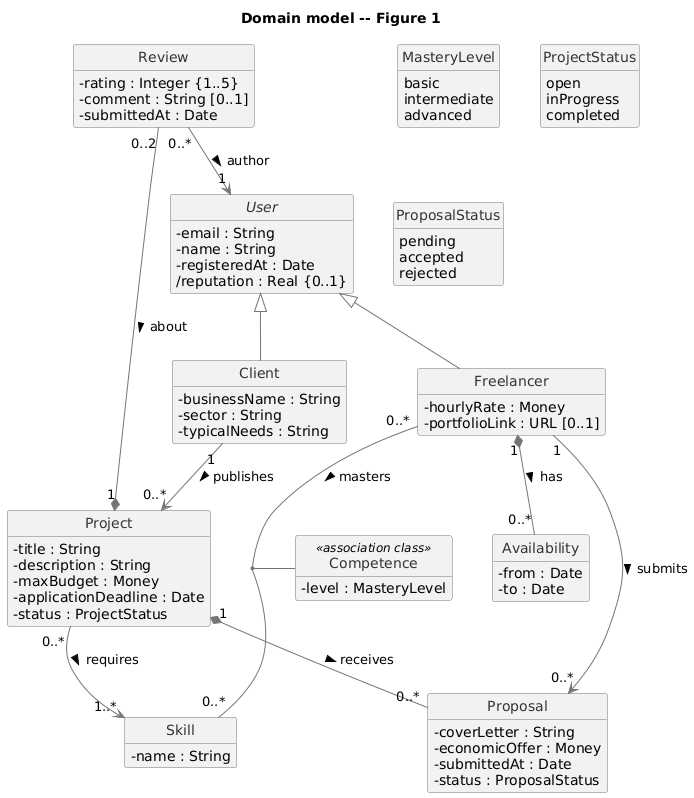
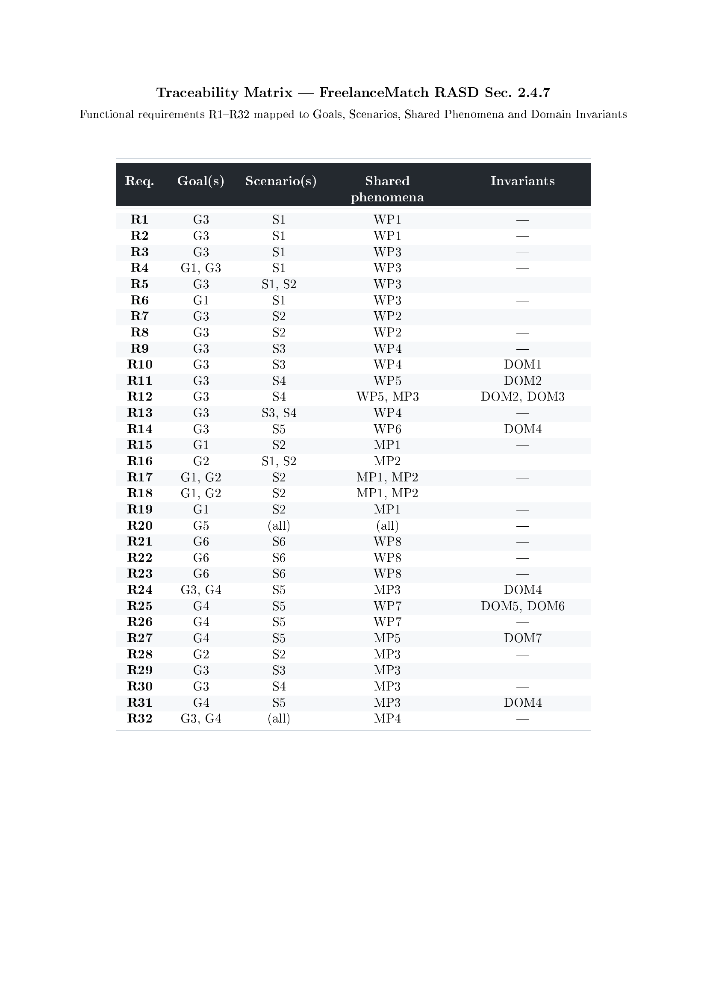
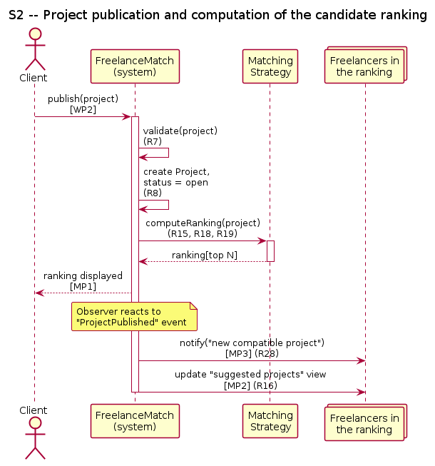

# Requirements Analysis and Specification Document

### FreelanceMatch
*A web platform for automatic freelancer–client matching*

---

**Politecnico di Milano**
Software Engineering for Automation — A.Y. 2025-2026

| | |
|---|---|
| **Authors** | Olmo Luca (10838404), Palladino Antonio (10778757), Pensotti Francesca (10777621) |
| **Repository** | `https://github.com/<owner>/SE4A_Olmo_Palladino_Pensotti` |

---
## Table of contents

- [1. Introduction](#1-introduction)
  - [1.1 Purpose](#11-purpose)
  - [1.2 Scope](#12-scope)
    - [1.2.1 World and machine](#121-world-and-machine)
    - [1.2.2 Shared phenomena](#122-shared-phenomena)
  - [1.3 Definitions, Acronyms, Abbreviations](#13-definitions-acronyms-abbreviations)
    - [1.3.1 Definitions](#131-definitions)
    - [1.3.2 Acronyms and abbreviations](#132-acronyms-and-abbreviations)
  - [1.4 Document structure](#14-document-structure)
- [2. Overall description](#2-overall-description)
  - [2.1 Scenarios](#21-scenarios)
  - [2.2 Domain model](#22-domain-model)
  - [2.3 User characteristics](#23-user-characteristics)
  - [2.4 Product functions](#24-product-functions)
  - [2.5 Non-functional aspects](#25-non-functional-aspects)
  - [2.6 Assumptions, dependencies and constraints](#26-assumptions-dependencies-and-constraints)
- [3. Additional models](#3-additional-models)
  - [3.1 Requirements-level sequence diagrams](#31-requirements-level-sequence-diagrams)
  - [3.2 Finite state machines](#32-finite-state-machines)
- [4. References](#4-references)

---

## Revision history

| Version | Date       | Notes                                                                                   |
|---------|------------|-----------------------------------------------------------------------------------------|
| 0.1     | 2026-05-05 | Initial draft. Section 1 (Introduction).                                                |
| 0.2     | 2026-05-05 | Simplified Sec. 1.2 (removed redundant *Goals* subsection). Definitions trimmed to terms used up to Sec. 1.4. |
| 0.3     | 2026-05-05 | Added Sec. 2.1 (Scenarios) and Sec. 2.2 (Domain model).                                 |
| 0.4     | 2026-05-05 | Sec. 2.1 rewritten in engineering style (flow-based descriptions, preconditions, exceptions). Sec. 2.2 unchanged. |
| 0.5     | 2026-07-07 | Complete revision 

---

## 1. Introduction

### 1.1 Purpose

FreelanceMatch is a web-based platform that mediates the encounter between freelance professionals and clients seeking to commission specific work. The problem the system addresses is the inefficiency of the manual search-and-filter workflow imposed by existing platforms (e.g., Upwork, Fiverr), where both sides must invest non-trivial time in sifting through profiles or postings before any contact can occur.

The system replaces (and, optionally, complements) this manual workflow with an automatic matching procedure: when a client publishes a project, the system computes a compatibility score for every available freelancer and presents a ranked shortlist; symmetrically, every freelancer receives a ranked list of projects whose requirements are compatible with their declared profile. Beyond the matching core, the platform manages the entire project lifecycle — from publication, through application and acceptance, to completion and mutual review — and maintains a reputation signal that feeds back into subsequent matches.

The high-level goals of the project are listed below; each goal is later refined into one or more functional requirements (Sec. 2.4) and traced from the corresponding scenarios (Sec. 2.1).

- **G1** — Help a Client identify, among all registered Freelancers, the ones genuinely suited to a specific Project — instead of leaving them to search and evaluate profiles unassisted.
- **G2** — Help a Freelancer identify, among all published Projects, the ones genuinely suited to their skills and availability — instead of leaving them to search unassisted.
- **G3** — Take a Project through its full lifecycle — publication, submission and evaluation of Proposals, selection of a Freelancer, completion — with both parties always aware of its current state.
- **G4** — Turn the outcome of a completed collaboration, captured through mutual Review, into a reputation signal that informs future matches for both parties.
- **G5** — Give both Client and Freelancer the ability to search and choose independently, alongside the automatic suggestions, rather than being limited to them.

### 1.2 Scope

This section describes who interacts with the system and what is exchanged at its boundary. We separate the *world*, i.e. the actors and processes outside the platform, from the *machine*, i.e. the platform itself.

#### 1.2.1 World and machine

The world includes:

- **Clients**, who publish projects and choose the freelancer they want to work with.
- **Freelancers**, who maintain a profile, look at the projects available, and apply to those they are interested in.
- The **execution of the work** itself, which happens off-platform. The system has no way to verify whether the work has been actually carried out: it relies on what the parties report.
- The **payment** between the two parties, which is also handled off-platform. The system records the agreed amount but does not collect or transfer money.

The machine — FreelanceMatch — is the web platform that stores profiles and projects, computes the matching, shows ranked lists to the users, and keeps track of proposals, accepted collaborations, reviews and reputations.

#### 1.2.2 Shared phenomena

The points of contact between the world and the machine are listed below. We distinguish actions performed by users (`WP`, world phenomena observed by the machine) from actions performed by the system (`MP`, machine phenomena observed by the world).

**Controlled by the world**

- **WP1** — A user signs up and chooses a role (client or freelancer).
- **WP2** — A client publishes a project, providing title, description, required skills, maximum budget and application deadline.
- **WP3** — A freelancer creates or updates the profile (skills with mastery level, hourly rate, availability, portfolio link).
- **WP4** — A freelancer sends a proposal for an open project, with a cover letter and an economic offer.
- **WP5** — A client accepts one of the proposals received.
- **WP6** — A client marks a project as completed.
- **WP7** — A user submits a review at the end of a collaboration.
- **WP8** — A user runs a manual search with filters.

**Controlled by the machine**

- **MP1** — The system shows to a client the ranked list of freelancers suggested for a project.
- **MP2** — The system shows to a freelancer the ranked list of projects compatible with the freelancer profile.
- **MP3** — The system sends notifications when relevant events happen (new compatible project, new proposal, proposal accepted or rejected, project completed, review window opened).
- **MP4** — The system displays a personal dashboard to each user.
- **MP5** — The system updates the reputation of a user when a new review on that user is submitted.

### 1.3 Definitions, Acronyms, Abbreviations

#### 1.3.1 Definitions

| Term | Definition |
|---|---|
| **Client** | A registered user whose role is "client". Clients publish projects and choose which proposal to accept. |
| **Freelancer** | A registered user whose role is "freelancer". Freelancers maintain a profile and apply to the projects they are interested in. |
| **Profile** | The set of attributes describing a registered user. Clients and freelancers have different profile fields. |
| **Skill** | A competence declared by a freelancer in their profile, associated with a mastery level among "basic", "intermediate" and "advanced". |
| **Project** | A work assignment published by a client, characterised by a title, a description, a list of required skills, a maximum budget (in euros) and an application deadline. |
| **Proposal** | A candidacy submitted by a freelancer for a specific project, containing a cover letter and an economic offer (in euros). A freelancer cannot submit more than one proposal per project. |
| **Collaboration** | The relationship between a client and a freelancer that starts when the client accepts a proposal and ends when the project is marked as completed. |
| **Review** | A 1–5 star rating with an optional textual comment, submitted by one of the two parties at the end of a collaboration. A review cannot be edited after submission. |
| **Reputation** | An aggregate value, normalised in `[0,1]`, computed from the reviews received by a user. Users with no reviews are assigned a neutral reputation. |
| **Compatibility score *S(P,F)*** | A number in `[0,1]` expressing how compatible freelancer *F* is with project *P*. It combines four sub-scores: skills coverage, budget, reputation and availability. |
| **Ranking** | The list of freelancers (resp. projects) ordered by *S(P,F)* in decreasing order. |
| **Matching** | The procedure that, given a project (or a freelancer), produces the corresponding ranking. |
| **Notification** | An in-app message delivered to a user when a relevant lifecycle event takes place (see MP3). |

#### 1.3.2 Acronyms and abbreviations

| Acronym | Meaning |
|---|---|
| RASD | Requirements Analysis and Specification Document |
| UML  | Unified Modeling Language |
| FSM  | Finite State Machine |
| WP   | World Phenomenon (controlled by the world) |
| MP   | Machine Phenomenon (controlled by the machine) |
| G    | Goal |
| R    | Functional Requirement |
| NFR  | Non-Functional Requirement |
| DOM  | Domain Assumption |
| DEP  | Dependencies |
| C  | Constraints |

### 1.4 Document structure

The remainder of this document is organised as follows.

**Section 2 (Overall description)** presents the requirements at a moderate level of detail. It opens with the description of the main interaction flows between the system and its actors (Sec. 2.1). It then formalises the entities and relationships of the application domain through a class diagram (Sec. 2.2), characterises the user classes (Sec. 2.3), enumerates the product's functional requirements (Sec. 2.4) and non-functional requirements (Sec. 2.5), and concludes with the assumptions, dependencies and constraints under which the requirements are valid (Sec. 2.6).

**Section 3 (Additional models)** refines the requirements where useful with UML sequence diagrams at the requirements level (Sec. 3.1) and finite state machines for the entities whose lifecycle is non-trivial, in particular `Project` and `Proposal` (Sec. 3.2).

**Section 4 (References)** lists the external sources cited throughout the document.

---

## 2. Overall description

### 2.1 Scenarios

This section describes the main interaction flows between FreelanceMatch and its actors. Each scenario is presented as a structured flow rather than as a narrative: it lists the actor that triggers it, the preconditions under which the flow can be executed, the main sequence of steps performed by the actor and by the system, the postconditions after a successful execution, and the relevant alternative or exception flows. Each step is annotated with the shared phenomena (`WP`/`MP`, see Sec. 1.2.2) that it exercises, so that the trace from the boundary description to the requirements (Sec. 2.4) is explicit.

The scenarios cover the lifecycle of the system from registration to review and span both directions of the matching (client-driven and freelancer-driven). The scenarios are intentionally separated by responsibility: where two actors interact across time, the flow is split at the system boundary so that each scenario remains driven by a single actor.

#### S1 — Account creation and profile setup

**Primary actor.** Any unregistered visitor.

**Preconditions.** The visitor has access to the public landing page; no authenticated session exists.

**Main flow.**
1. The actor selects a role among `client` and `freelancer` and submits the registration data *(WP1)*.
2. The system validates the data (well-formed email, role consistency) and creates a `User` record with an initial neutral reputation `0.5`.
3. The actor completes the role-specific profile fields *(WP3)*: a `Client` provides business name, sector and typical needs; a `Freelancer` provides one or more `Competence`s (each pointing to a `Skill` with a mastery level), the hourly rate, one or more `Availability` windows and an optional portfolio link.
4. The system persists the profile and indexes it for use by the matching procedure (Sec. 2.2).

**Postconditions.** The actor holds an authenticated session bound to the chosen role. For freelancers, the profile is now eligible to appear in the ranking of any open project whose required skills overlap with the declared competences.

**Alternatives and exceptions.**
- *Duplicate email.* The system rejects the registration without creating any record.
- *Incomplete mandatory fields.* The system refuses to persist the profile and reports the missing fields; the user remains in an unauthenticated or partially configured state.
- *Skill not present in the catalogue.* The freelancer can request the addition of a new `Skill`; until the request is approved, the corresponding `Competence` is not used by the matching.

---

#### S2 — Project publication and computation of the candidate ranking

**Primary actor.** An authenticated `Client`.

**Preconditions.** The client has at least one valid payment-and-contact configuration on the profile (the system does not collect payments, but the contact information must be present).

**Main flow.**
1. The client submits a new project specifying: title, description, set of required `Skill`s, maximum budget, application deadline *(WP2)*.
2. The system validates the project (mandatory fields present, deadline in the future, budget ≥ 0, at least one required skill) and creates a `Project` with `status = open`.
3. The system triggers the matching procedure with the active strategy (Sec. 2.2 and `R26`). For every freelancer *F* whose hard filters are satisfied, the system computes the compatibility score *S(P,F)*.
4. The system ranks freelancers by *S(P,F)* in decreasing order, truncates to the top *N* (where *N* is a configuration parameter), and exposes the ranking to the client *(MP1)*.
5. The system delivers a notification of "new compatible project" to the freelancers in the ranking *(MP3)* and updates their personal "suggested projects" view *(MP2)*.

**Postconditions.** The project is visible in the catalogue with `status = open`; the ranking is available to the client for inspection until the application deadline expires or until a proposal is accepted (whichever comes first).

**Alternatives and exceptions.**
- *No freelancer satisfies the hard filters.* The system creates the project with an empty ranking and informs the client. The project remains open for manual applications.
- *Profile updates after publication.* If a freelancer updates the profile in a way that would have made them eligible for a project still in `open` state, the matching is recomputed for that project (the trigger is on profile-update events as well, per the *Observer* contract in Deliverable 2).

---

#### S3 — Submission of a proposal by a freelancer

**Primary actor.** An authenticated `Freelancer`.

**Preconditions.** The target project has `status = open`, the application deadline has not expired, and the freelancer has not already submitted a proposal for the same project (R14).

**Main flow.**
1. The freelancer accesses the project — either from the suggested ranking *(MP2)*, from a notification *(MP3)*, or via manual search (S6).
2. The freelancer submits a proposal containing a cover letter and an economic offer in euros *(WP4)*.
3. The system validates the offer (numeric, ≥ 0, within plausible bounds) and creates a `Proposal` with `status = pending`, linked to the freelancer and to the project.
4. The system delivers a notification of "new proposal" to the project owner *(MP3)*.

**Postconditions.** The proposal is in the project's list of received proposals, ordered by *S(P,F)* of the corresponding freelancer.

**Alternatives and exceptions.**
- *Application deadline expired between display and submission.* The system rejects the submission, informs the freelancer and refreshes the project view.
- *Project moved to* `inProgress` *between display and submission* (i.e. another proposal was accepted in the meantime). Same handling as the previous case.
- *Duplicate proposal* (R14). The system rejects the second submission and points the freelancer to the existing one.

---

#### S4 — Acceptance of a proposal and transition to `inProgress`

**Primary actor.** The `Client` owner of the project.

**Preconditions.** The project has `status = open` and at least one `Proposal` with `status = pending`.

**Main flow.**
1. The client inspects the list of received proposals, ordered by *S(P,F)* *(MP1)*.
2. The client accepts one specific proposal *(WP5)*.
3. The system performs, atomically with respect to other lifecycle transitions of the same project: (i) sets the chosen proposal's `status` to `accepted`; (ii) sets every other pending proposal of the same project to `status = rejected`; (iii) sets the project's `status` to `inProgress`. This sequence realises R15 (at most one accepted proposal per project) and R16 (the transition, including the project status update, is atomic).
4. The system delivers an "accepted" notification to the chosen freelancer and a "rejected" notification to every other involved freelancer *(MP3)*.
5. From this point on, the project is removed from the open catalogue and refuses any further submission attempt (see S3 exceptions).

**Postconditions.** Exactly one accepted proposal exists for the project; the project is in `inProgress`; the application channel is closed.

**Alternatives and exceptions.**
- *Concurrent acceptance attempts.* The transitions in step 3 are serialised; the second attempt observes `status ≠ open` and is rejected.
- *Cancellation by the client before acceptance.* (Out of scope of this iteration; an open project can only transition to `inProgress` or remain `open` until the deadline.)

---

#### S5 — Completion of the collaboration and mutual review

**Primary actor.** The `Client` owner of the project (for completion); both parties (for the review).

**Preconditions.** The project has `status = inProgress` and exactly one `Proposal` with `status = accepted` (R16).

**Main flow.**
1. The client marks the project as completed *(WP6)*. The system transitions the project to `status = completed` (R18) and opens the review window for both parties.
2. The system delivers a "review window opened" notification to the client and to the freelancer of the accepted proposal *(MP3)*.
3. Each party (independently) submits at most one review whose `target` is the counterpart, providing a 1–5 rating and an optional comment *(WP7)*. R31 governs the existence and uniqueness of each review.
4. On submission of every review, the system updates the `reputation` of the target user as a function of the reviews where the user is the target (R33), and immediately reflects the new value in any subsequent matching computation (R34) *(MP5)*.

**Postconditions.** The project is in `completed`; up to two reviews exist for the project (one per party); the reputations of both users reflect the new reviews.

**Alternatives and exceptions.**
- *One party never submits the review.* The system does not block the lifecycle: the missing review simply does not exist; the existing one is still recorded and counted.
- *Attempt to edit a submitted review.* The system rejects the modification (review is single-shot by definition).

---

#### S6 — Manual search and filtered browsing

**Primary actor.** Any authenticated user.

**Preconditions.** The actor is authenticated; no specific notification or ranking is required.

**Main flow.**
1. The actor opens the manual search view, distinct from the suggested ranking, and submits a query with filters *(WP8)*. The available filters depend on the role: a client filters freelancers by required skills, hourly-rate range and availability window; a freelancer filters projects by category, budget range and deadline window.
2. The system returns the records satisfying the filters and offers an explicit secondary ordering choice (by *S(P,F)*, by deadline, or by budget).
3. From the result list, the actor can navigate to a specific project (and trigger S3) or to a specific freelancer profile.

**Postconditions.** No state change is induced by the search itself. Any subsequent action (e.g. proposal submission) follows its own scenario.

**Alternatives and exceptions.**
- *Empty result set.* The system returns the empty list with an explicit indication; no error.
- *Filter values inconsistent with the catalogue* (e.g. budget range that no project satisfies). Same handling as empty result set.

---

The flows above span every shared phenomenon listed in Sec. 1.2.2 at least once: WP1, WP3 in S1; WP2 in S2; WP4 in S3 (and reused in S6 as the entry point); WP5 in S4; WP6, WP7 in S5; WP8 in S6; MP1 and MP3 are exercised in multiple scenarios (S2, S3, S4, S5); MP2 in S2; MP4 is implicitly exercised whenever any scenario produces a state change; MP5 in S5.

### 2.2 Domain model

This section formalises the entities of the application domain and the relationships between them. The model is intentionally kept at the conceptual level: it captures *what* the system has to talk about, not *how* it stores it. Figure 1 shows the resulting UML class diagram. The PlantUML source is in `diagrams/domain_model.puml`.

**Actors and roles.** Every person registered on the platform is a `User`. The two roles a user can have, *Client* and *Freelancer*, are modelled as subclasses: a `User` is exactly one of the two and the role is fixed at registration time. The attributes that are common to both (e.g. email, registration date, reputation) live in `User`; the role-specific attributes — business-related fields for `Client`, hourly rate and portfolio for `Freelancer` — live in the respective subclasses.

**Skills and competences.** Skills are first-class citizens of the domain: the same `Skill` (e.g. "Figma") can be required by many projects and declared by many freelancers, and the matching procedure needs to compare them by identity rather than by string. The mastery level is not a property of the skill itself — it is a property of the relation between a `Freelancer` and a `Skill`, and it is reified through the class `Competence`. This gives a clean place to attach the mastery level (`basic` / `intermediate` / `advanced`) without polluting either side of the association. Because `Competence` associates exactly one pair `(Freelancer, Skill)`, the model guarantees structurally that a freelancer cannot declare two different mastery levels for the same skill.

**Availability.** Each `Freelancer` declares zero or more `Availability` windows (intervals of dates), used by the matching to assess whether the freelancer is free during the lifetime of a project. An `Availability` window is owned by its `Freelancer` (composition): it has no identity or lifecycle independent of the freelancer who declared it.

**Projects and proposals.** A `Project` is published by a `Client` and lists one or more required `Skill`s. It carries its own status — `open`, `inProgress` or `completed` — that drives the lifecycle described in Sec. 3.2. A `Proposal` is the candidacy of a freelancer for a project, with cover letter, economic offer and its own status (`pending`, `accepted` or `rejected`). A `Proposal` is owned by the `Project` it responds to (composition) — it cannot outlive the project it was submitted to — while its link to the submitting `Freelancer` is a plain reference: the freelancer is not part of the proposal, only its author. We deliberately do not introduce a separate "Collaboration" class: a collaboration is uniquely identified by a `Project` whose status is `inProgress` or `completed` together with the unique `Proposal` whose status is `accepted` for that project, and modelling it as a separate entity would be redundant.

**Reviews.** A `Review` carries a rating (1–5), an optional comment and a timestamp. Each review has two explicit associations: an *author* (the user who wrote it) and a reference to the `Project` to which the collaboration refers. The `Project` association is a composition — a review has no existence independent of the project it refers to — while the *author* link is a plain reference to a `User` who continues to exist independently. The target is deliberately not stored as a third association: it is derived as the counterpart of the collaboration on that `Project` — the `Client` owner if the author is the accepted `Freelancer`, or vice versa — since the two parties of a completed project are already fully determined by the project itself. This shape lets the system enforce the constraint that for each completed project there are at most two reviews — one per author — and lets the reputation of a user be derived as an aggregate over the reviews where the user is the (derived) target.

### 2.3 User characteristics

The system has two end-user classes. Although both interact with the platform through the same web client and share the authentication facility, they exercise disjoint sets of functional requirements, have different incentives, and contribute different inputs to the matching procedure. 

#### 2.3.1 Client
 
A client is the party that commissions the work. In the most common instantiation a client is a small or medium business (agency, studio, SME) without an internal capacity for a specific task, but the model is the same for an individual commissioning a one-off piece of work; the system makes no distinction between organisational and individual clients beyond the `businessName` field of the profile *(R4)*.
 
Clients are expected to be able to articulate what they need in terms of required `Skill`s; the platform supplies the controlled vocabulary of skills, with a request mechanism for missing entries, so that the input is structured rather than free text *(R8–R10)*.
 
A client is expected to know, at the moment of publishing a `Project`, both the budget ceiling and the deadline they are working with, rather than negotiating these terms after proposals start arriving *(R11, R24)*.
 
A client interacts intensively with the platform during three short windows of the project lifecycle (publication, inspection of proposals, completion) and not at all in between; the client is brought back into the system by notifications, not by polling *(R35–R36)*. A client may also have several `Project`s open at once, each progressing independently through its own lifecycle *(R39)*.
 
When the automatic ranking does not fully capture a client's priorities — e.g. a hard ceiling on hourly rate, or a specific availability window a freelancer must satisfy — the client is expected to fall back on manual search rather than have no recourse at all *(R27, G5)*.
 
#### 2.3.2 Freelancer
 
A freelancer is the party that performs the work. The system assumes that freelancers are autonomous professionals rather than employees of an agency; no organisational hierarchy is modelled *(Sec. 2.2)*.
 
Freelancers are expected to know their own profession well enough to characterise their skills with a mastery level out of three (`basic`/`intermediate`/`advanced`). The granularity is intentionally coarse so that the input is robust against optimistic self-evaluation and remains useful to the matching *(Sec. 2.2 — MasteryLevel)*.
 
A freelancer is expected to submit proposals to several `Project`s concurrently and, for each one, to expect a definite, timely outcome rather than an indefinitely pending state *(R37, R16)*.
 
A freelancer is expected to interact with the platform more frequently than a client: profile maintenance, inspection of suggested projects, application to one or more of them, follow-up on pending proposals *(NFR1, NFR3)*.
 
A freelancer has a direct incentive to see good work reflected back into future opportunities: reputation accumulated from past collaborations is not just a display value but a live input to every subsequent ranking computed for that freelancer *(G4, R33, R40)*. As with the client, when the automatic ranking does not surface every project a freelancer would consider, manual search remains available as a fallback *(R28, G5)*.

---

### 2.4 Product functions

This section enumerates the functional requirements of the system. Requirements are labelled `R1`, `R2`, …, and are grouped by macro-area so that each cluster corresponds to a coherent slice of the system. Within each group, every requirement is stated in a single "shall" sentence; cross-references to the scenarios of Sec. 2.1, to the goals of Sec. 1.1, to the shared phenomena of Sec. 1.2.2 and to the domain assumptions of Sec. 2.6.1 (where a requirement's correctness relies on one) are collected in the traceability matrix of Sec. 2.4.8.

#### 2.4.1 Account and profile management

- **R1** — The system shall allow an unregistered visitor to register an account by providing an email, a password and a role in {`client`, `freelancer`}.
- **R2** — The system shall reject a registration whose email is already associated with an existing account.
- **R3** — The system shall reject a registration whose email is not well-formed (syntactically valid address).
- **R4** — The system shall allow a `Client` to maintain a profile containing business name, sector and typical needs.
- **R5** — The system shall allow a `Freelancer` to maintain a profile containing a non-empty set of `Competence`s (each pairing a `Skill` with a mastery level), an hourly rate ≥ 0, a non-empty set of `Availability` windows, and an optional portfolio link.
- **R6** — The system shall allow any registered user to update their own profile at any time.
- **R7** — The system shall persist a profile change before returning control to the user.
- **R8** — The system shall maintain a controlled vocabulary of `Skill`s.
- **R9** — The system shall reject any `Competence` referring to a `Skill` not present in the controlled vocabulary.
- **R10** — The system shall allow a user to request the addition of a new `Skill`, and shall keep the request pending until an administrator approves it.

#### 2.4.2 Project lifecycle

- **R11** — The system shall allow a `Client` to publish a `Project` by providing a title, a description, a non-empty set of required `Skill`s, a maximum budget ≥ 0 and an application deadline strictly in the future.
- **R12** — The system shall set the `status` of a newly published `Project` to `open`.
- **R13** — The system shall allow a `Freelancer` to submit a `Proposal` (cover letter and economic offer ≥ 0) for a `Project` only if the `Project` is `open` and its application deadline has not expired.
- **R14** — The system shall reject a second `Proposal` submitted by the same `Freelancer` for the same `Project`.
- **R15** — The system shall allow the `Client` owner of an `open` `Project` to accept exactly one of its `pending` `Proposal`s.
- **R16** — Upon acceptance of a `Proposal`, the system shall set that `Proposal` to `accepted`, every other `pending` `Proposal` of the same `Project` to `rejected`, and the `Project` to `inProgress`, as a single atomic transition.
- **R17** — The system shall refuse any `Proposal` submission targeting a `Project` whose `status` is not `open`.
- **R18** — The system shall allow the `Client` owner of an `inProgress` `Project` to mark it as completed, setting its `status` to `completed`. 

#### 2.4.3 Matching

- **R19** — Upon publication of a `Project`, the system shall compute a ranking of the eligible `Freelancer`s ordered by decreasing compatibility score *S(P,F)*, truncated to a configurable length *N*.
- **R20** — The system shall expose to the `Client` owner the ranking computed for their `Project`.
- **R21** — Upon creation or update of a `Freelancer`'s profile, the system shall recompute that `Freelancer`'s ranking of compatible `open` `Project`s.
- **R22** — The system shall expose to each `Freelancer` their ranking of compatible `open` `Project`s on the "suggested projects" view.
- **R23** — Upon creation or update of a `Freelancer`'s profile that changes their eligibility for an `open` `Project`, the system shall recompute that `Project`'s `Freelancer` ranking. *(reverse direction of R21)*
- **R24** — The system shall compute *S(P,F)* as a weighted combination of four sub-scores — skills coverage, budget compatibility, reputation, availability — each normalised in `[0,1]`, with administrator-configurable weights summing to 1.
- **R25** — The system shall exclude from the ranking, before computing *S(P,F)*, any `Freelancer` that fails an active hard filter.
- **R26** — The system shall allow substitution of the active strategy by configuration.

#### 2.4.4 Manual search

- **R27** — The system shall provide every authenticated `Client` a search over the catalogue of `Freelancer`s with filters on required `Skill`s, hourly-rate range and availability window.
- **R28** — The system shall provide every authenticated `Freelancer` a search over the catalogue of `open` `Project`s with filters on required skill set, budget range and application-deadline window.
- **R29** — The system shall allow the actor of a search to choose a secondary ordering of the results among: compatibility score, deadline (ascending), budget (descending).

#### 2.4.5 Reviews and reputation

- **R30** — Upon a `Project` transitioning to `completed`, the system shall open a review window for both parties of the collaboration.
- **R31** — The system shall allow each party of a `completed` `Project` to submit at most one `Review` of the counterpart, with a rating in {1,2,3,4,5} and an optional comment. 
- **R32** — The system shall refuse any modification or deletion of a `Review` after submission.
- **R33** — Upon submission of a `Review`, the system shall update the `reputation` of the target user.
- **R34** — Upon submission of a `Review`, the system shall make the updated reputation value available to subsequent matching computations.

#### 2.4.6 Notifications and dashboard

- **R35** — The system shall deliver an in-app notification to each `Freelancer` in the ranking of a newly published `Project`.
- **R36** — The system shall deliver an in-app notification to the `Client` owner of a `Project` on each new `Proposal` for that `Project`.
- **R37** — Upon acceptance of a `Proposal`, the system shall deliver an "accepted" notification to the chosen `Freelancer` and a "rejected" notification to every other `Freelancer` whose `Proposal` was rejected.
- **R38** — Upon a `Project` transitioning to `completed`, the system shall deliver a "review window opened" notification to both parties.
- **R39** — The system shall provide each authenticated user a personal dashboard showing the current state of their own `Project`s (`Client`) or `Proposal`s (`Freelancer`).
- **R40** — The dashboard shall show the user their current `reputation`.

#### 2.4.7 Cross-cutting behaviour

- **R41** — Every request that successfully changes the system's state shall receive a response containing the identifier of the affected entity and its resulting state.
- **R42** — The system shall refuse any authenticated request targeting data belonging to a user other than the requester.
- **R43** — The system shall allow an authenticated user to retrieve all personal data associated with their account.
- **R44** — The system shall allow an authenticated user to request deletion of their account and associated personal data.
- **R45** — The system shall expose, via a dedicated endpoint, aggregate metrics on the contact rate of suggested freelancers and the acceptance rate of suggested projects.
- **R46** — The system shall allow the `Client` owner of an `open` `Project` to update its title and description.

#### 2.4.8 Traceability matrix

---

### 2.5 Non-functional aspects

The following non-functional requirements (NFR) are organised by the ISO/IEC 25010 quality characteristics relevant to this system: Performance, Reliability and availability, and Usability. Each predicates over a quality axis that is independent of functional correctness — the system can be functionally correct and still score anywhere along that axis (e.g. correct but slow, correct but occasionally unreachable). They are stated at a level of detail sufficient to guide the architectural decisions in Deliverable 2 and the testing strategy in Deliverable 3.

### 2.5.1 Performance

- **NFR1** — Server response time for interactive (non-matching) requests shall be ≤ 300 ms at the 95th percentile, under at least *C* = 20 concurrent simulated sessions.
- **NFR2** — Computation and delivery of the freelancer ranking following a project publication shall complete within 2 s, for a catalogue of up to *K* = 500 freelancers.
- **NFR3** — Recomputing a freelancer's project ranking following a profile update shall add no more than *Δ* = 500 ms to the response time of the triggering request.
- **NFR4** — An in-app notification shall be delivered within 5 s of the event that generates it.

### 2.5.2 Reliability and availability

- **NFR5** — The system shall be available with uptime ≥ 99% on a monthly basis during 08:00–20:00 CET; planned maintenance windows shall be communicated at least 24h in advance and scheduled outside this window.
  
### 2.5.3 Usability

- **NFR6** — A first-time user shall be able to complete registration and profile setup within 5 minutes without external assistance, in ≥ 90% of cases.

**Note:** At this stage of the project, none of the non-functional requirements above has been verified against a running system: doing so — measuring response times under load, monthly uptime, or first-time-user completion rates — requires a deployed instance and, in several cases, real users or realistic traffic, which are not available yet. The NFRs are nonetheless stated here, with concrete thresholds, to make explicit what a production-quality version of the system would be expected to satisfy. For this reason, the numeric thresholds (95th percentile, uptime percentages, time limits) should be read as indicative reference values rather than as figures that have been measured or validated.

---

### 2.6 Assumptions, dependencies and constraints

This section collects the conditions under which the requirements of Sec. 2.4 and 2.5 are valid. They are split into three categories: *domain assumptions* (statements about the world that the system relies on but does not control), *dependencies* (external services or resources the system needs), *constraints* (limitations on the system or its development that the team has accepted or that have been imposed).

#### 2.6.1 Domain assumptions

The following assumptions are about the *world* and the system cannot enforce them — it relies on them being true.

- **DOM1** — Users are honest in their self-declarations. The hourly rate, the mastery levels and the availability windows declared by a `Freelancer`, as well as the budget and the description declared by a `Client`, are taken at face value: the system has no means of independently verifying them.
- **DOM2** — The execution and the financial settlement of the contracted work take place outside the system. The system has no observability over whether the work has been actually carried out, paid for, or to what level of quality; it relies entirely on the act of the `Client` marking the project as completed (WP6) and on the subsequent reviews (WP7).
- **DOM3** — The two parties of a collaboration are honest in their reviews. It is assumed that parties do not review their own contributions. The system has no knowledge for the quality of the work other than the reviews themselves; the resulting `reputation` is therefore as reliable as the reviews that feed it.
- **DOM4** — A user has a single platform identity. The system assumes one human (or one organisation) corresponds to at most one registered account. Detection of duplicate identities (e.g. multiple accounts of the same physical person) is not in scope.
- **DOM5** — The controlled vocabulary of `Skill`s is sufficient for the description of the projects and the profiles in the target market segment, modulo the request-and-approval mechanism for new skills (R10).

#### 2.6.2 Dependencies

- **DEP1** — The system depends on the availability of a relational or document-oriented data store with transactional guarantees sufficient for the atomicity required by R16.
- **DEP2** — The system depends on an outbound email service for the email-verification step at registration. Failure of the email service degrades the registration flow (the user cannot verify the email) but does not corrupt the rest of the system.
- **DEP3** — The system runs on a server-side runtime and a web client that are themselves dependencies; the specific choice of stack is deferred to Deliverable 2.

#### 2.6.3 Constraints

- **C1** — The system is delivered as a web application. Native mobile clients (iOS, Android) are not in scope of this iteration.
- **C2** — The system mediates the encounter between the two parties but does not act as an intermediary for payments or for the work itself. The platform records the agreed amount as part of the accepted proposal but neither collects nor disburses funds (consistent with DOM2).
- **C3** — The system does not perform identity verification beyond the email-verification step at registration. Legal identity, fiscal residence, professional certification and similar checks are not in scope.
- **C4** — Dispute resolution between the two parties of a collaboration is out of scope. The system records the resulting reviews (if any) but does not attempt to mediate the dispute.
- **C5** — The compatibility-score weights and the size *N* of the ranking truncation are configuration parameters, not user-facing settings. The decision of when and how to retune them is taken by the administrator.
- **C6** — The matching algorithm is intended to operate on the catalogue of profiles available on the platform; it does not consult external sources (e.g. professional networks, public CVs).

---

## 3. Additional models

This section refines a small number of requirements with additional UML models, where a textual flow alone would leave room for ambiguity. The criterion for including a diagram in this section is simple: the diagram is included only when it adds information that is not already evident from the scenarios of Sec. 2.1 or the requirements of Sec. 2.4. Scenarios whose flow is fully captured by the textual description in Sec. 2.1 are not duplicated as sequence diagrams here.

### 3.1 Requirements-level sequence diagrams

Two sequence diagrams are included, corresponding to the two scenarios in which the interaction between the actors and the system involves multiple steps and side effects that are not immediately visible from the text of Sec. 2.1: the publication of a project with the cascading update of the suggested rankings (S2), and the acceptance of a proposal with the atomic transition and the cascade of rejection notifications (S4).

The remaining scenarios — S1 (registration), S3 (single-actor proposal submission), S5 (review submission), S6 (manual search) — are not depicted as sequence diagrams: each of them consists of a single round-trip between an actor and the system, with no propagation of effects to third parties, and the textual description in Sec. 2.1 is already self-contained.

#### 3.1.1 S2 — Project publication and matching

Figure 2 shows the interaction triggered by a client publishing a project. The diagram highlights three aspects that are easy to miss in the textual flow: (i) the matching procedure is invoked through a separate `MatchingStrategy` collaborator, consistently with R19 and R26; (ii) the ranking is exposed to the client *and* propagates to every freelancer in the ranking, both as a notification (R35) and as an update of the personal "suggested projects" view (R22); (iii) these side effects are presented as the reaction of an observer to the `ProjectPublished` event, anticipating the *Observer* contract that will be formalised in Deliverable 2.

#### 3.1.2 S4 — Proposal acceptance and atomic transition

Figure 3 shows the interaction triggered by a client accepting a proposal. The aspect that requires the diagram, and that the text of Sec. 2.1 can describe but not display, is the *atomic block* over three transitions: the chosen proposal moves to `accepted`, every other pending proposal of the same project moves to `rejected`, and the project itself moves to `inProgress`. The three transitions either commit together or do not happen at all (R16), and only after the commit are the notifications dispatched (R37). The diagram also makes visible the fact that, from this point on, the project refuses any further submission attempt (R17).

### 3.2 Finite state machines

Two domain entities have a lifecycle whose transitions are non-trivial and are referenced by multiple requirements: `Project` and `Proposal`. For each of them, the finite state machine below collects in a single picture all the transitions, the events that trigger them, and the requirements that govern them. The state names match exactly the values of the corresponding `status` attribute introduced in Sec. 2.2.

#### 3.2.1 Project lifecycle

Figure 4 shows the lifecycle of a `Project`. There are three states (`open`, `inProgress`, `completed`) and only two non-trivial transitions: `open → inProgress` (triggered by the acceptance of a proposal, R15/R16) and `inProgress → completed` (triggered by the client marking the project as completed, R18). The state `open` admits a self-transition corresponding to updates of the project's own metadata (R46), allowed while the project has not yet entered the in-progress phase. The state `completed` is terminal as far as the `Project` itself is concerned: the subsequent submission of reviews is governed by the lifecycle of `Review`, which is intentionally not included here as a separate FSM because it consists of a single state transition (a `Review` is either submitted or it does not exist, and once submitted it cannot be modified — see R32).

#### 3.2.2 Proposal lifecycle

Figure 5 shows the lifecycle of a `Proposal`. There are three states (`pending`, `accepted`, `rejected`). The transition from `pending` to `accepted` corresponds to the explicit choice of the client owner of the parent project. The transition from `pending` to `rejected` has two sources: the explicit rejection of a proposal is not foreseen as a separate action in this iteration of the system (a client can only accept; the rejection of the other proposals is a cascading effect of the acceptance, R16). Both terminal states are final: once a proposal is accepted or rejected, it cannot be reverted (R15 admits at most one accepted proposal per project, and a rejected proposal is not allowed to be re-evaluated).

---

## 4. References

The references listed below are the sources cited explicitly or implicitly throughout this document. The list is kept intentionally minimal: a reference is included only if it has actually been used as the basis for a modelling choice or for a piece of terminology in the rest of the document.

- **[1]** M. Jackson, *The World and the Machine*, in Proc. of the 17th International Conference on Software Engineering (ICSE '95), Seattle, WA, USA, IEEE Computer Society, 1995, pp. 283–292. — Source for the world/machine distinction used in Sec. 1.2.
- **[2]** A. van Lamsweerde, *Requirements Engineering: From System Goals to UML Models to Software Specifications*. Wiley, 2009. — Reference for the goal-oriented framing of Sec. 1.1 (G1–G5) and for the structure of the scenarios in Sec. 2.1.
- **[3]** Object Management Group, *OMG Unified Modeling Language (OMG UML), Version 2.5.1*, formal/2017-12-05, December 2017. Available: https://www.omg.org/spec/UML/2.5.1 — Notation reference for all UML diagrams (Sec. 2.2, Sec. 3).
- **[4]** PlantUML Reference Guide. Available: https://plantuml.com (last accessed: 2026-05-05). — Tool used to author the diagram sources committed in `diagrams/`.
- **[5]** E. Gamma, R. Helm, R. Johnson, and J. Vlissides, *Design Patterns: Elements of Reusable Object-Oriented Software*. Addison-Wesley, 1994. — Source for the *Strategy* and *Observer* patterns referenced by R26 and by Sec. 3.1.
- **[6]** M. Fowler, *Patterns of Enterprise Application Architecture*. Addison-Wesley, 2002. — Source for the *Repository* pattern that will be used in Deliverable 2 and that motivates the data-access boundary mentioned in Sec. 2.6.2.
- **[7]** M. Camilli, *Software Engineering for Automation — Project Guideline, A.Y. 2024-2025*. Politecnico di Milano, 2024. — Source for the structure of this document and the deliverables that follow.

